# Модуль 2. Разработка базы данных по ER-диаграмме (MySQL через phpMyAdmin)

**Цель:** создать БД и таблицы по ER, настроить PK/FK/ограничения, затем импортировать `Заказчики.json`.

---

## 0. Важно перед стартом

* Везде ниже используется **один вариант выполнения**: **Конструктор (phpMyAdmin GUI)**

* Рекомендуемая структура: используем одну БД `dairy_demo`.
  Отдельный namespace `app` не создаётся — таблицы размещаются внутри базы данных.

---

## 1. Создание базы данных

1. Запустите **XAMPP Control Panel**.

   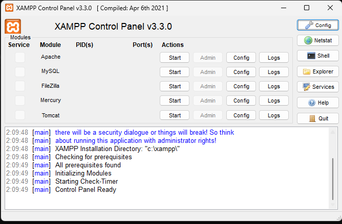

   /// caption
   Рисунок 1 – Открытие XAMPP Control Panel
   ///

2. Включите модуль **Apache**:

   * нажмите кнопку **Start** в строке **Apache**;
   * дождитесь, что статус изменится на **Running** (строка станет активной).

   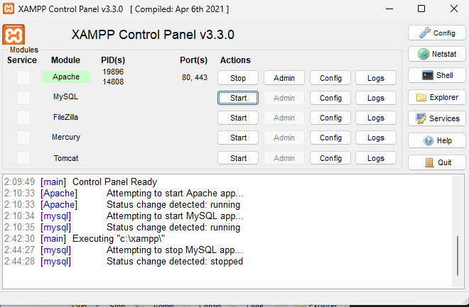

   /// caption
   Рисунок 2 – Запуск Apache (статус Running)
   ///

3. Включите модуль **MySQL**:

   * нажмите кнопку **Start** в строке **MySQL**;
   * дождитесь, что статус изменится на **Running**.

   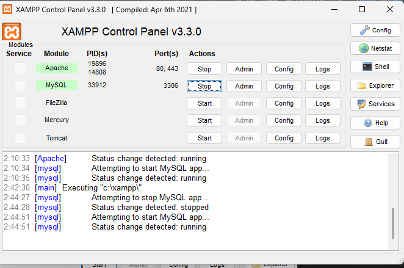

   /// caption
   Рисунок 3 – Запуск MySQL (статус Running)
   ///

4. Откройте **phpMyAdmin** одним из способов:

   **Вариант A (из XAMPP):**

   * нажмите кнопку **Admin** в строке **MySQL**.

   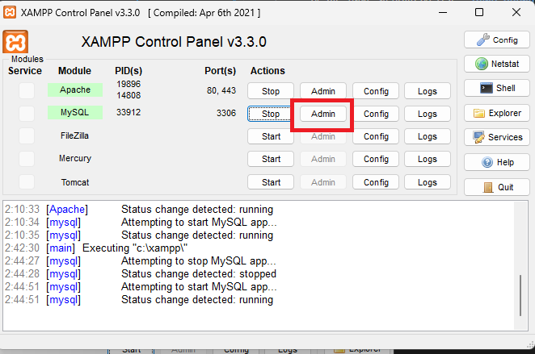

   /// caption
   Рисунок 4 – Открытие phpMyAdmin через кнопку Admin
   ///

   **Вариант B (через браузер):**

   * откройте браузер и перейдите по адресу:

   ```text
   http://localhost/phpmyadmin/
   ```

   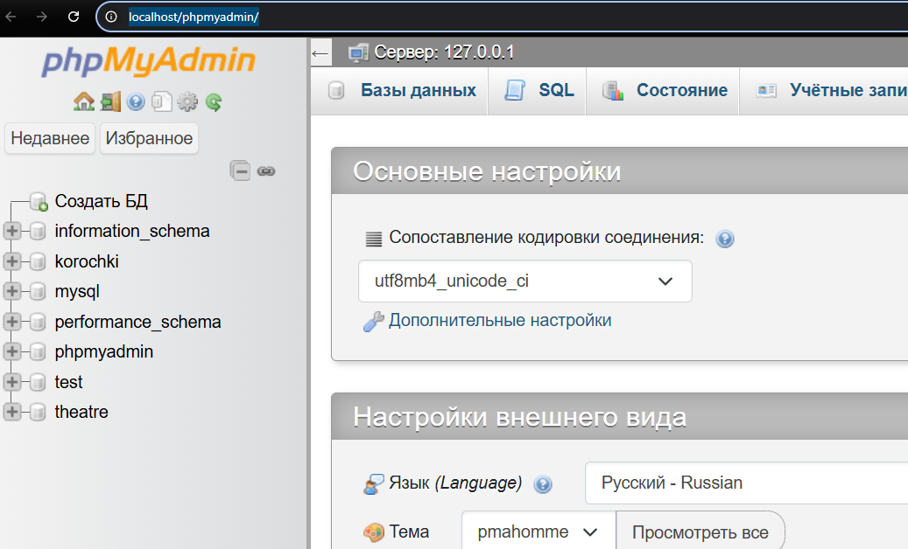

   /// caption
   Рисунок 5 – Открытие phpMyAdmin через браузер (localhost)
   ///

5. Убедитесь, что phpMyAdmin открылся без ошибок и вы видите главную страницу интерфейса (панель слева + рабочая область справа).

   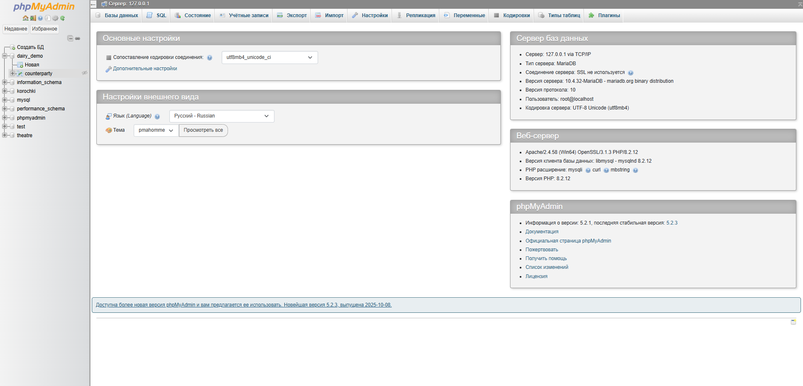

   /// caption
   Рисунок 6 – Главная страница phpMyAdmin
   ///

6. Создайте базу данных:

   1. Перейдите на вкладку **Databases** (Базы данных).
   2. В поле **Create database** введите: `dairy_demo`.
   3. В поле **Collation** выберите: `utf8mb4_unicode_ci` (рекомендуется).
   4. Нажмите **Create**.

   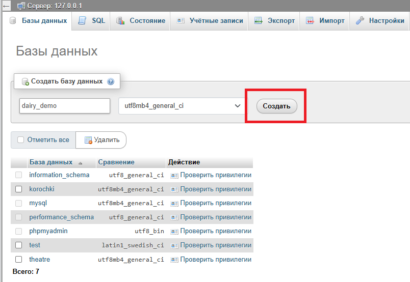

   /// caption
   Рисунок 7 – Создание базы данных `dairy_demo`
   ///

7. Проверьте, что база данных создана:

   * в левой панели (дереве) появилась БД **dairy_demo**;
   * при клике по ней открывается вкладка **Structure**.

   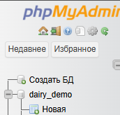

   /// caption
   Рисунок 8 – База данных `dairy_demo` появилась в дереве phpMyAdmin
   ///

---

> Примечание: если при открытии `http://localhost/phpmyadmin/` появляется ошибка, проверьте, что **Apache** и **MySQL** действительно в статусе **Running**, и что порты не заняты другими программами (часто конфликтует порт 80 у Apache).

---


## 2. Логическое разделение `app` (как аналог схемы)

Все таблицы создаются в выбранной базе данных `dairy_demo`.

> Если по требованиям нужно визуально отделять таблицы “приложения”, используйте префиксы имён:
> `app_counterparty`, `app_item`, `app_price` и т. д.

---

## 3. Создание таблиц по ER-диаграмме (через GUI)

> Ниже перечислены основные сущности. Для каждой — описание через конструктор.

---

### 3.1. COUNTERPARTY (Контрагент)

1. Выберите базу данных `dairy_demo` в левой панели phpMyAdmin.

2. Перейдите на вкладку **Structure** (Структура) → нажмите **Create table** (Создать таблицу).

   

   /// caption
   Рисунок 9 – Создание таблицы
   ///

3. Укажите:

   * **Table name:** `counterparty`
   * **Number of columns:** 7
   * Нажмите **Go**.

   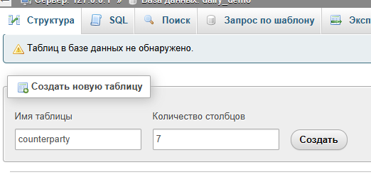

   /// caption
   Рисунок 10 – Задание имени таблицы
   ///

4. Добавьте поля (Columns):

| Field       | Type    | Length | Null | Default | Index   | Extra          |
| ----------- | ------- | ------ | ---- | ------- | ------- | -------------- |
| id          | BIGINT  |        | NO   |         | PRIMARY | AUTO_INCREMENT |
| name        | VARCHAR | 255    | NO   |         |         |                |
| inn         | VARCHAR | 32     | YES  | NULL    |         |                |
| address     | VARCHAR | 255    | YES  | NULL    |         |                |
| phone       | VARCHAR | 64     | YES  | NULL    |         |                |
| is_salesman | TINYINT | 1      | NO   | 0       |         |                |
| is_buyer    | TINYINT | 1      | NO   | 0       |         |                |

Обратите внимание:

* Для `id`:

      * установите **Index → PRIMARY**
      * включите **A_I (Auto Increment)**

* Для `name`:

      * снимите флаг `Null` (то есть NOT NULL)

* Для `is_salesman` и `is_buyer`:

      * тип `TINYINT(1)`
      * Default = `0`
      * NOT NULL

      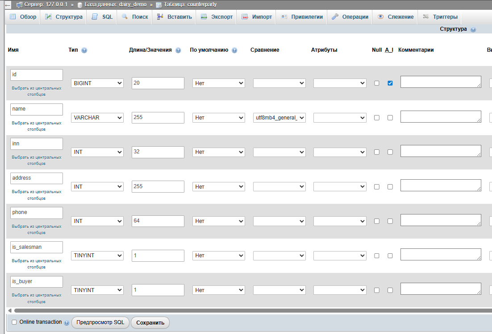

      /// caption
      Рисунок 11 – Настройка структуры таблицы `counterparty`
      ///

5. Внизу формы проверьте:

   * Storage Engine: **InnoDB**
   * Collation: `utf8mb4_unicode_ci`

6. Нажмите **Save** (или **Go**) для создания таблицы.

   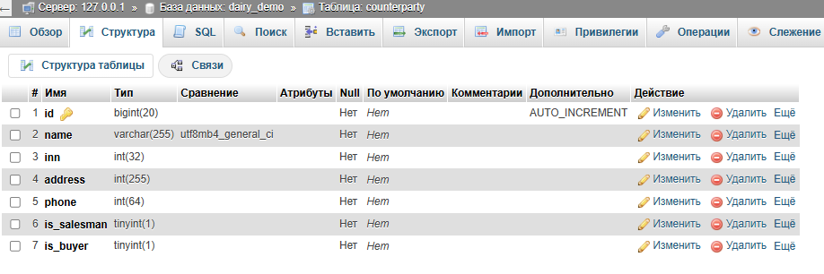

   /// caption
   Рисунок 12 – Проверка PRIMARY KEY и AUTO_INCREMENT
   ///

---

### Проверка

После сохранения:

* откройте таблицу `counterparty`
* вкладка **Structure**
* убедитесь, что:

  * у поля `id` указан ключ 🔑 PRIMARY
  * в столбце Extra указано `AUTO_INCREMENT`

При необходимости можно проверить через SQL:

```sql
SHOW CREATE TABLE counterparty;
```

В выводе должно присутствовать:

```sql
PRIMARY KEY (`id`)
```

и

```sql
`id` bigint NOT NULL AUTO_INCREMENT
```
 
---

### 3.2. ITEM (Номенклатура)

1. Create → Table… Name: `item`

2. Columns:

      * `id` type: BIGINT NOT NULL AUTO_INCREMENT
      * `code` type: `text`, Unique (см. Constraints)
      * `name` type: `text`, Not null
      * `item_type` type: `text`, Not null
      * `unit_default` type: `text`

3. Constraints:

      * Primary Key: `id`
      * Unique: `code`

4. Check constraint (вкладка Constraints → Check):

      * Name: `chk_item_type`
      * Expression: `item_type IN ('product','material')`

5. Save.

  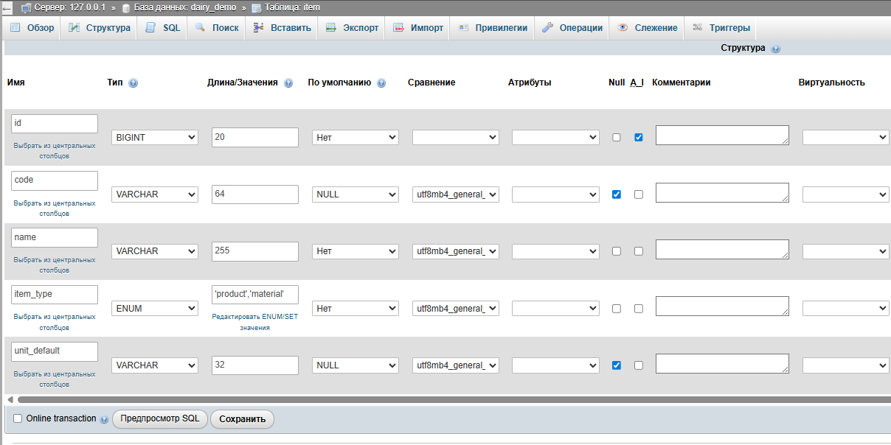
   /// caption
   Рисунок 13 – ITEM
   ///

---

### 3.3. PRICE (Прайс-лист)


1. Create table `price`

2. Columns:

      * `id` BIGINT NOT NULL AUTO_INCREMENT
      * `item_id` bigint Not null
      * `price` numeric(12,2) Not null
      * `effective_from` date (optional)
      * `effective_to` date (optional)

3. Foreign Keys:

      * `item_id` → `app.item(id)`
      * On update: CASCADE
      * On delete: RESTRICT

4. Check constraints:

      * `price >= 0`
      * `effective_to IS NULL OR effective_from IS NULL OR effective_to >= effective_from`

5. Save.

  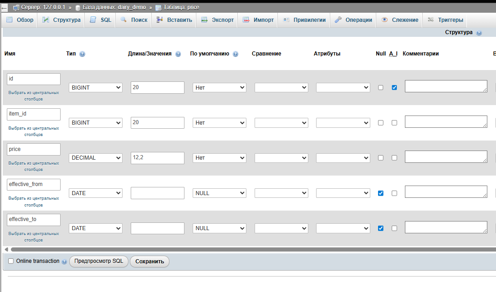
   /// caption
   Рисунок 14 – PRICE
   ///
---

### 3.4. SPECIFICATION и SPECIFICATION_MATERIAL

#### SPECIFICATION


1. Table `specification`

2. Columns:

      * `id`   BIGINT NOT NULL AUTO_INCREMENT
      * `name` text Not null
      * `product_item_id` bigint Not null
      * `output_qty` numeric(12,3) Not null default 1
      * `output_unit` text
      * `manufacturer_id` text

3. FK:

      * `product_item_id` → `app.item(id)` (RESTRICT)
      * `manufacturer_id` → `app.counterparty(id)` (RESTRICT)

4. Check: `output_qty > 0`

5. Save.

  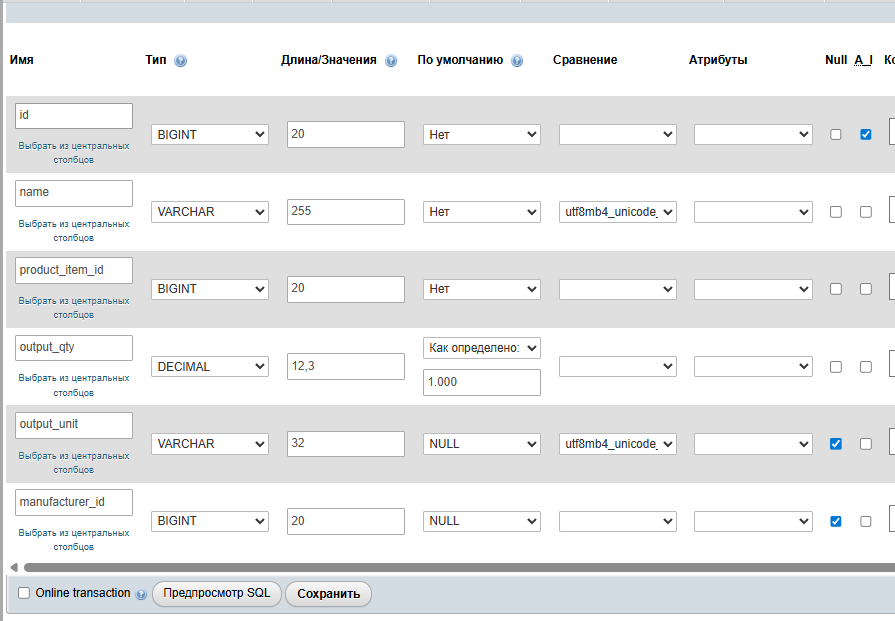
   /// caption
   Рисунок 15 – SPECIFICATION
   ///

#### SPECIFICATION_MATERIAL


1. Table `specification_material`

2. Columns:

      * `id`   BIGINT NOT NULL AUTO_INCREMENT
      * `specification_id` bigint Not null
      * `material_item_id` bigint Not null
      * `qty` numeric(12,3) Not null
      * `unit` text

3. FK:

      * `specification_id` → `app.specification(id)` ON DELETE CASCADE
      * `material_item_id` → `app.item(id)` ON DELETE RESTRICT

4. Unique constraint:

      * `(specification_id, material_item_id)`

5. Check: `qty > 0`

6. Save.


  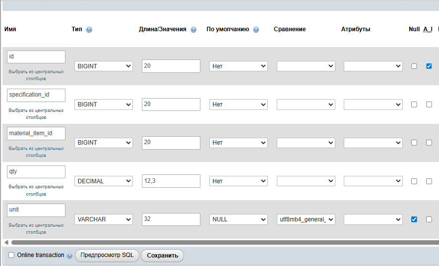
   /// caption
   Рисунок 16 – SPECIFICATION_MATERIAL
   ///
---

### 3.5. PRODUCTION_ORDER, PRODUCTION_PRODUCT_LINE, PRODUCTION_MATERIAL_LINE


Создайте три таблицы по аналогии с предыдущими:

#### PRODUCTION_ORDER

1. Table `production_order`

2. Columns:

   * `id` BIGINT NOT NULL AUTO_INCREMENT
   * `doc_no` VARCHAR(64) NOT NULL
   * `doc_date` DATE NULL
   * `manufacturer_id` BIGINT NULL
   * `note` TEXT NULL

3. Indexes:

   * Primary Key: `id`
   * Index: `idx_prodorder_manufacturer` on (`manufacturer_id`)

4. FK:

   * `manufacturer_id` → `counterparty(id)`

     * ON UPDATE CASCADE
     * ON DELETE RESTRICT

5. Storage:

   * Engine: `InnoDB`
   * Charset: `utf8mb4`
   * Collation: `utf8mb4_unicode_ci`

6. Save.


  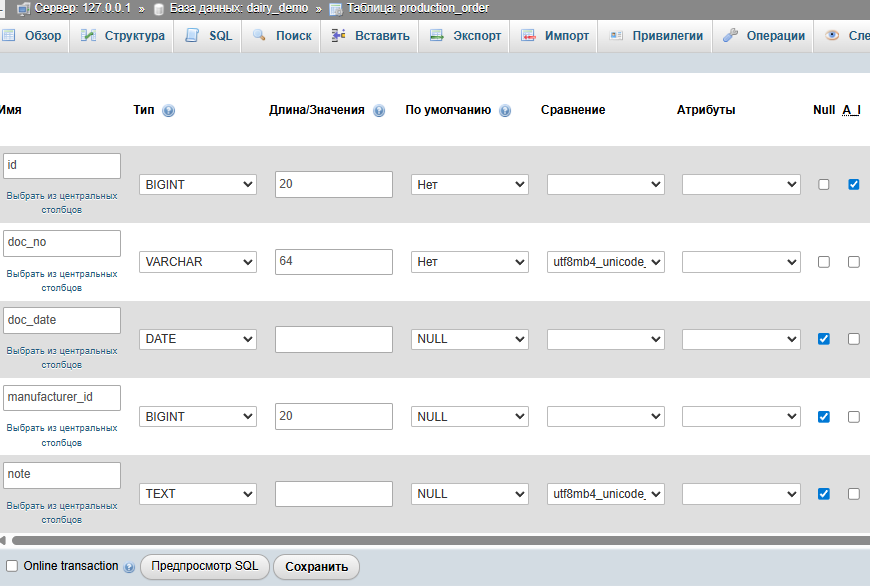
   /// caption
   Рисунок 17 – PRODUCTION_ORDER
   ///

   * затем `production_product_line` и `production_material_line` (FK на `production_order` и `item`),
   * обязательно выставьте `ON DELETE CASCADE` на строках документа.

#### PRODUCTION_PRODUCT_LINE

1. Table `production_product_line`

2. Columns:

   * `id` BIGINT NOT NULL AUTO_INCREMENT
   * `production_order_id` BIGINT NOT NULL
   * `product_item_id` BIGINT NOT NULL
   * `qty` DECIMAL(12,3) NOT NULL
   * `unit` VARCHAR(32) NULL

3. Indexes:

   * Primary Key: `id`
   * Index: `idx_prodprod_order` on (`production_order_id`)
   * Index: `idx_prodprod_item` on (`product_item_id`)

4. FK:

   * `production_order_id` → `production_order(id)`

     * ON UPDATE CASCADE
     * ON DELETE CASCADE

   * `product_item_id` → `item(id)`

     * ON UPDATE CASCADE
     * ON DELETE RESTRICT

5. Recommended constraint (контроль бизнес-логики):

   * Check: `qty > 0`
     *(если используется MySQL 8.0.16+ можно добавить CHECK, иначе контролируется на уровне приложения)*

6. Storage:

   * Engine: `InnoDB`
   * Charset: `utf8mb4`
   * Collation: `utf8mb4_unicode_ci`

7. Save.


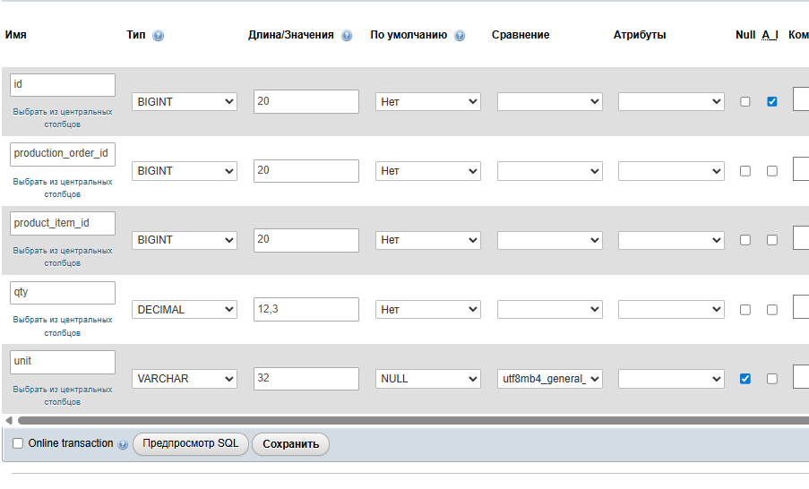
   /// caption
   Рисунок 18 – PRODUCTION_PRODUCT_LINE
   ///

#### PRODUCTION_MATERIAL_LINE

1. Table `production_material_line`

2. Columns:

   * `id` BIGINT NOT NULL AUTO_INCREMENT
   * `production_order_id` BIGINT NOT NULL
   * `material_item_id` BIGINT NOT NULL
   * `qty` DECIMAL(12,3) NOT NULL
   * `unit` VARCHAR(32) NULL

3. Indexes:

   * Primary Key: `id`
   * Index: `idx_prodmat_order` on (`production_order_id`)
   * Index: `idx_prodmat_item` on (`material_item_id`)

4. FK:

   * `production_order_id` → `production_order(id)`

     * ON UPDATE CASCADE
     * ON DELETE CASCADE

   * `material_item_id` → `item(id)`

     * ON UPDATE CASCADE
     * ON DELETE RESTRICT

5. Recommended constraint (контроль бизнес-логики):

   * Check: `qty > 0`
     *(если используется MySQL 8.0.16+ можно добавить CHECK, иначе контроль реализуется на уровне приложения)*

6. Storage:

   * Engine: `InnoDB`
   * Charset: `utf8mb4`
   * Collation: `utf8mb4_unicode_ci`

7. Save.

   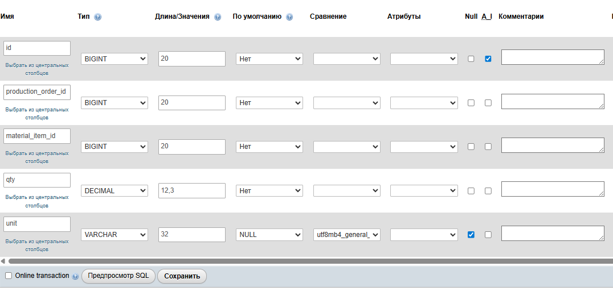
   /// caption
   Рисунок 19 – PRODUCTION_MATERIAL_LINE
   ///

---

### 3.6. CUSTOMER_ORDER и CUSTOMER_ORDER_LINE

#### CUSTOMER_ORDER

1. Table `customer_order`

2. Columns:

   * `id` BIGINT NOT NULL AUTO_INCREMENT
   * `doc_no` VARCHAR(64) NOT NULL
   * `doc_date` DATE NULL
   * `executor_id` BIGINT NULL
   * `customer_id` BIGINT NULL
   * `total_amount` DECIMAL(12,2) NULL

3. Indexes:

   * Primary Key: `id`
   * Index: `idx_custorder_executor` on (`executor_id`)
   * Index: `idx_custorder_customer` on (`customer_id`)

4. FK:

   * `executor_id` → `counterparty(id)`

     * ON UPDATE CASCADE
     * ON DELETE RESTRICT

   * `customer_id` → `counterparty(id)`

     * ON UPDATE CASCADE
     * ON DELETE RESTRICT

5. Recommended constraints (контроль бизнес-логики):

   * `total_amount >= 0`
     *(если используется MySQL 8.0.16+ можно добавить CHECK, иначе контроль реализуется на уровне приложения)*

6. Storage:

   * Engine: `InnoDB`
   * Charset: `utf8mb4`
   * Collation: `utf8mb4_unicode_ci`

7. Save.

   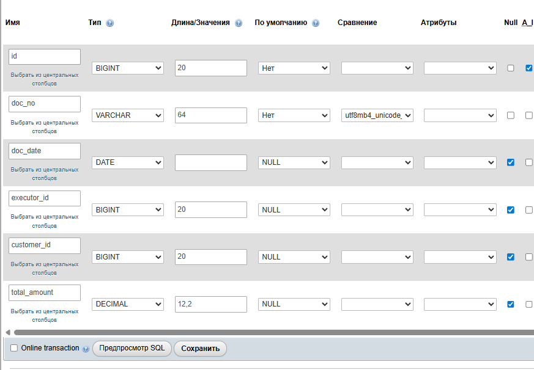
   /// caption
   Рисунок 20 – CUSTOMER_ORDER
   ///


#### CUSTOMER_ORDER_LINE

1. Table `customer_order_line`

2. Columns:

   * `id` BIGINT NOT NULL AUTO_INCREMENT
   * `customer_order_id` BIGINT NOT NULL
   * `product_item_id` BIGINT NOT NULL
   * `qty` DECIMAL(12,3) NOT NULL
   * `unit` VARCHAR(32) NULL
   * `unit_price` DECIMAL(12,2) NULL
   * `line_amount` DECIMAL(12,2) NULL

3. Indexes:

   * Primary Key: `id`
   * Index: `idx_custline_order` on (`customer_order_id`)
   * Index: `idx_custline_item` on (`product_item_id`)

4. FK:

   * `customer_order_id` → `customer_order(id)`

     * ON UPDATE CASCADE
     * ON DELETE CASCADE

   * `product_item_id` → `item(id)`

     * ON UPDATE CASCADE
     * ON DELETE RESTRICT

5. Recommended constraints (контроль бизнес-логики):

   * `qty > 0`
   * `unit_price >= 0`
   * `line_amount >= 0`

   *(если используется MySQL 8.0.16+ можно добавить CHECK; иначе контроль реализуется на уровне приложения)*

6. Storage:

   * Engine: `InnoDB`
   * Charset: `utf8mb4`
   * Collation: `utf8mb4_unicode_ci`

7. Save.


   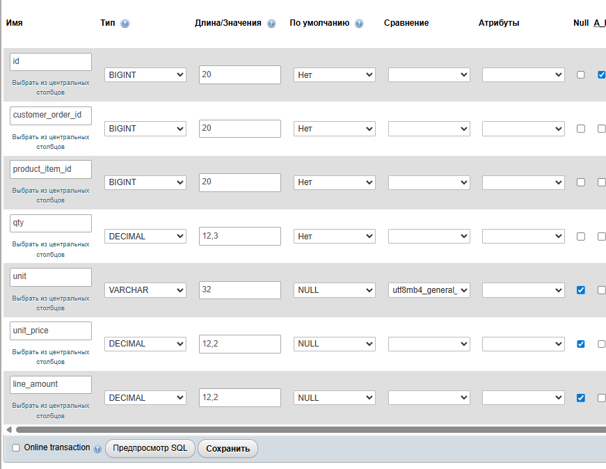
   /// caption
   Рисунок 21 – CUSTOMER_ORDER_LINE
   ///
---

### 3.7. COST_CALCULATION и COST_CALCULATION_LINE

#### COST_CALCULATION

1. Table `cost_calculation`

2. Columns:

   * `id` BIGINT NOT NULL AUTO_INCREMENT
   * `calc_date` DATE NULL
   * `product_item_id` BIGINT NOT NULL
   * `product_qty` DECIMAL(12,3) NOT NULL DEFAULT 1.000
   * `total_cost` DECIMAL(12,2) NULL

3. Indexes:

   * Primary Key: `id`
   * Index: `idx_costcalc_product` on (`product_item_id`)

4. FK:

   * `product_item_id` → `item(id)`

     * ON UPDATE CASCADE
     * ON DELETE RESTRICT

5. Recommended constraints (контроль бизнес-логики):

   * `product_qty > 0`
   * `total_cost >= 0`

   *(если используется MySQL 8.0.16+ можно добавить CHECK; иначе контроль реализуется на уровне приложения)*

6. Storage:

   * Engine: `InnoDB`
   * Charset: `utf8mb4`
   * Collation: `utf8mb4_unicode_ci`

7. Save.


   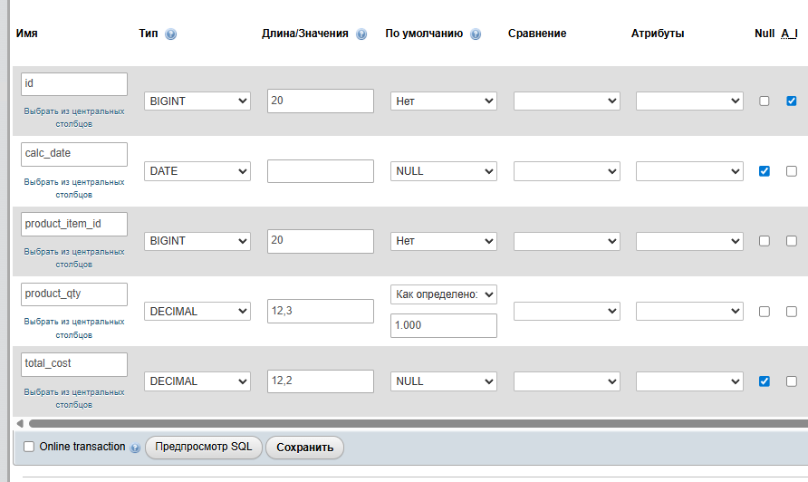
   /// caption
   Рисунок 22 – CUSTOMER_ORDER_LINE
   ///

#### COST_CALCULATION_LINE

1. Table `cost_calculation_line`

2. Columns:

   * `id` BIGINT NOT NULL AUTO_INCREMENT
   * `cost_calculation_id` BIGINT NOT NULL
   * `material_item_id` BIGINT NOT NULL
   * `qty` DECIMAL(12,3) NOT NULL
   * `unit` VARCHAR(32) NULL
   * `unit_cost` DECIMAL(12,2) NULL
   * `line_cost` DECIMAL(12,2) NULL

3. Indexes:

   * Primary Key: `id`
   * Index: `idx_costline_calc` on (`cost_calculation_id`)
   * Index: `idx_costline_item` on (`material_item_id`)

4. FK:

   * `cost_calculation_id` → `cost_calculation(id)`

     * ON UPDATE CASCADE
     * ON DELETE CASCADE

   * `material_item_id` → `item(id)`

     * ON UPDATE CASCADE
     * ON DELETE RESTRICT

5. Recommended constraints (контроль бизнес-логики):

   * `qty > 0`
   * `unit_cost >= 0`
   * `line_cost >= 0`

   *(если используется MySQL 8.0.16+ можно добавить CHECK; иначе контроль реализуется на уровне приложения)*

6. Storage:

   * Engine: `InnoDB`
   * Charset: `utf8mb4`
   * Collation: `utf8mb4_unicode_ci`

7. Save.


   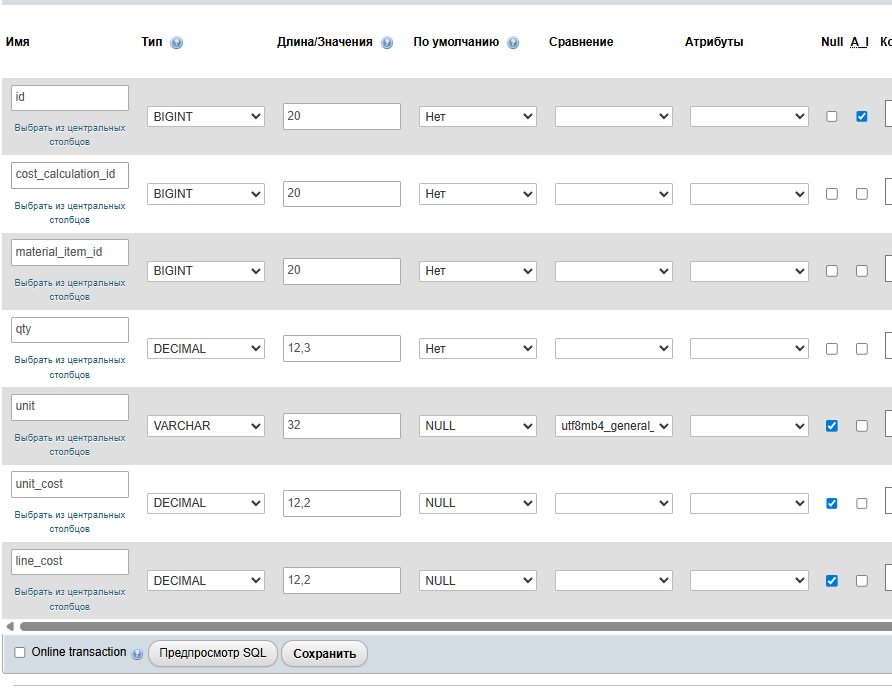
   /// caption
   Рисунок 23 – CUSTOMER_ORDER_LINE
   ///

Ниже — раздел **3.8. Связывание таблиц (Foreign Keys) через конструктор phpMyAdmin**
с добавленными иллюстрациями. Нумерация рисунков начинается с **24**.

---

## 3.8. Связывание таблиц (Foreign Keys) через конструктор phpMyAdmin

---

### 3.8.1. Где настраиваются связи

1. Откройте таблицу (например, `price`).
2. Перейдите во вкладку **Structure**.
3. Внизу страницы нажмите **Relation view**.

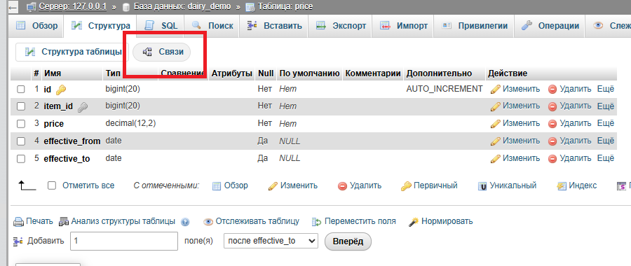

/// caption
Рисунок 24 – Переход к вкладке Relation view
///

---

### 3.8.2. PRICE → ITEM

`ON UPDATE CASCADE`
`ON DELETE RESTRICT`

1. Таблица: `price`
2. Relation view → добавьте:

   * Column: `item_id`
   * Referenced table: `item`
   * Referenced column: `id`
   * ON UPDATE: `CASCADE`
   * ON DELETE: `RESTRICT`

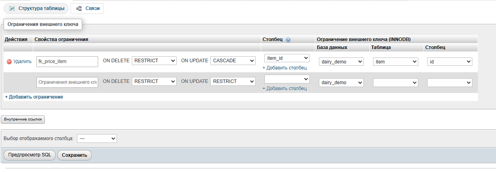

/// caption
Рисунок 25 – Связь price → item
///

Нажмите **Save**.

---

### 3.8.3. SPECIFICATION → ITEM, COUNTERPARTY

Таблица: `specification` → Relation view

#### Связь 1: product_item_id → item(id)

* ON UPDATE: CASCADE
* ON DELETE: RESTRICT

#### Связь 2: manufacturer_id → counterparty(id)

* ON UPDATE: CASCADE
* ON DELETE: RESTRICT

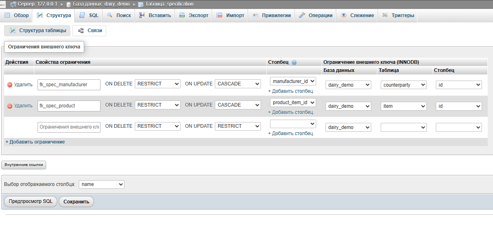

/// caption
Рисунок 26 – Связи specification
///

---

### 3.8.4. SPECIFICATION_MATERIAL → SPECIFICATION, ITEM

Таблица: `specification_material` → Relation view

#### Связь 1: specification_id → specification(id)

* ON UPDATE: CASCADE
* ON DELETE: CASCADE

#### Связь 2: material_item_id → item(id)

* ON UPDATE: CASCADE
* ON DELETE: RESTRICT

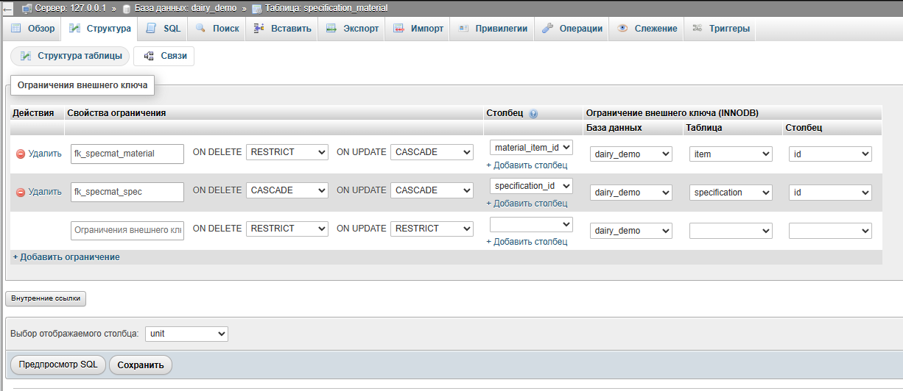

/// caption
Рисунок 27 – Связи specification_material
///

---

### 3.8.5. PRODUCTION_ORDER → COUNTERPARTY

Таблица: `production_order` → Relation view

Связь:

* manufacturer_id → counterparty(id)
* ON UPDATE: CASCADE
* ON DELETE: RESTRICT

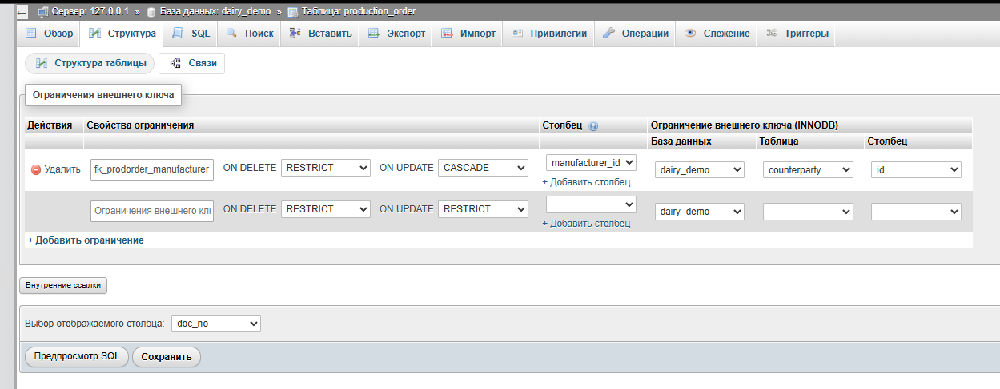

/// caption
Рисунок 28 – Связь production_order
///

---

### 3.8.6. PRODUCTION_PRODUCT_LINE → PRODUCTION_ORDER, ITEM

Таблица: `production_product_line` → Relation view

#### Связь 1: production_order_id → production_order(id)

* ON UPDATE: CASCADE
* ON DELETE: CASCADE

#### Связь 2: product_item_id → item(id)

* ON UPDATE: CASCADE
* ON DELETE: RESTRICT

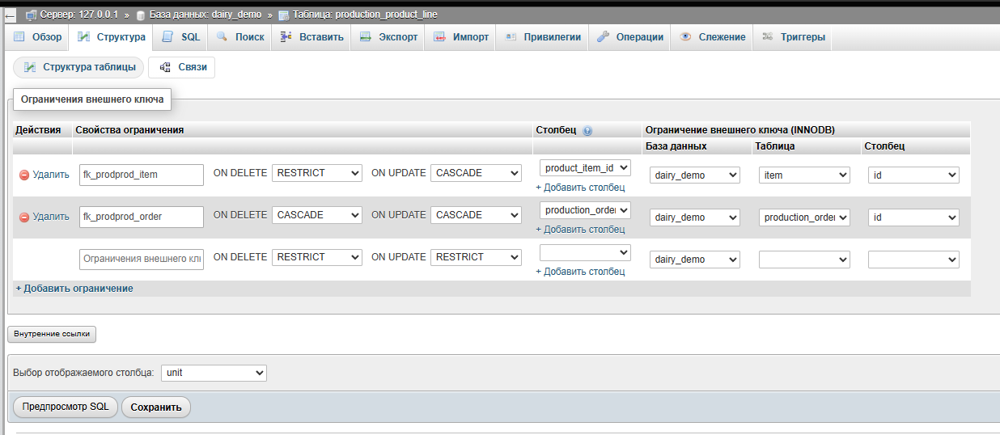

/// caption
Рисунок 29 – Связи production_product_line
///

---

### 3.8.7. PRODUCTION_MATERIAL_LINE → PRODUCTION_ORDER, ITEM

Таблица: `production_material_line` → Relation view

#### Связь 1: production_order_id → production_order(id)

* ON UPDATE: CASCADE
* ON DELETE: CASCADE

#### Связь 2: material_item_id → item(id)

* ON UPDATE: CASCADE
* ON DELETE: RESTRICT

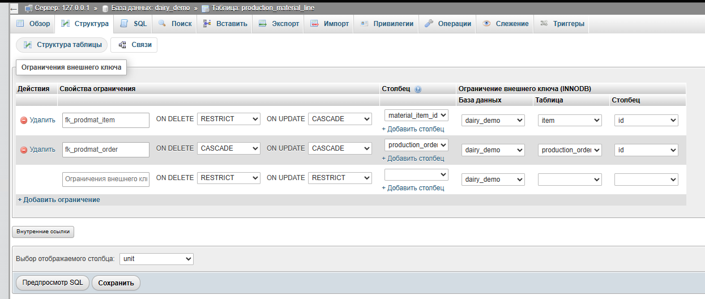

/// caption
Рисунок 30 – Связи production_material_line
///

---

### 3.8.8. CUSTOMER_ORDER → COUNTERPARTY

Таблица: `customer_order` → Relation view

#### Связь 1: executor_id → counterparty(id)

* ON UPDATE: CASCADE
* ON DELETE: RESTRICT

#### Связь 2: customer_id → counterparty(id)

* ON UPDATE: CASCADE
* ON DELETE: RESTRICT

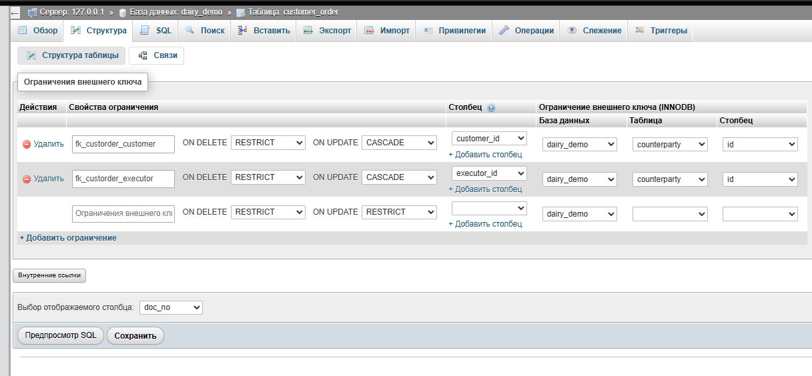

/// caption
Рисунок 31 – Связи customer_order
///

---

### 3.8.9. CUSTOMER_ORDER_LINE → CUSTOMER_ORDER, ITEM

Таблица: `customer_order_line` → Relation view

#### Связь 1: customer_order_id → customer_order(id)

* ON UPDATE: CASCADE
* ON DELETE: CASCADE

#### Связь 2: product_item_id → item(id)

* ON UPDATE: CASCADE
* ON DELETE: RESTRICT

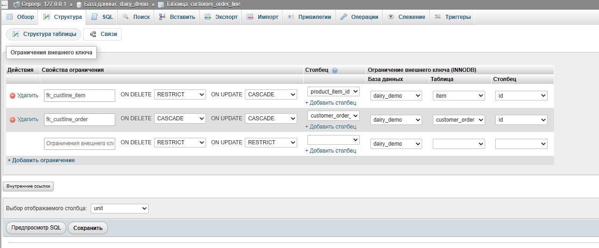

/// caption
Рисунок 32 – Связи customer_order_line
///

---

### 3.8.10. COST_CALCULATION → ITEM

Таблица: `cost_calculation` → Relation view

* product_item_id → item(id)
* ON UPDATE: CASCADE
* ON DELETE: RESTRICT

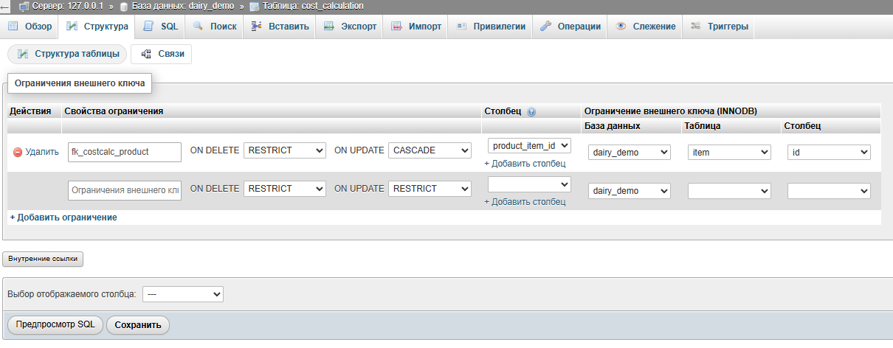

/// caption
Рисунок 33 – Связь cost_calculation
///

---

### 3.8.11. COST_CALCULATION_LINE → COST_CALCULATION, ITEM

Таблица: `cost_calculation_line` → Relation view

#### Связь 1: cost_calculation_id → cost_calculation(id)

* ON UPDATE: CASCADE
* ON DELETE: CASCADE

#### Связь 2: material_item_id → item(id)

* ON UPDATE: CASCADE
* ON DELETE: RESTRICT

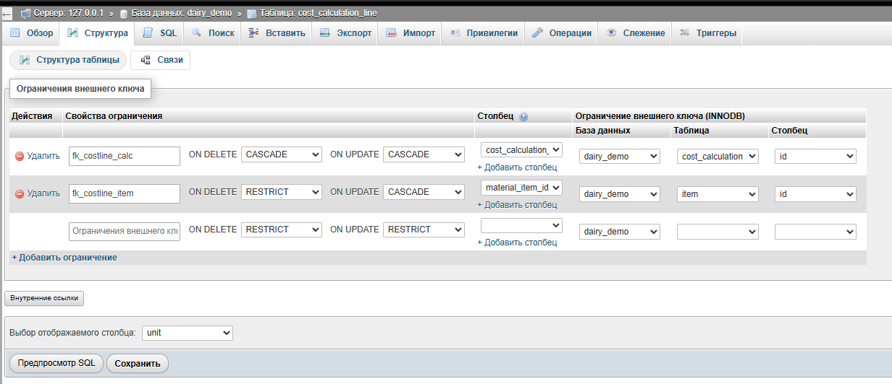

/// caption
Рисунок 34 – Связи cost_calculation_line
///

---

## Проверка корректности связей

После создания всех связей:

1. Откройте таблицу → **Structure**
2. Перейдите в **Relation view**
3. Убедитесь, что отображаются все Foreign Key ограничения

Дополнительно можно проверить через SQL:

```sql
SHOW CREATE TABLE production_product_line;
```

В выводе должны присутствовать строки:

```sql
FOREIGN KEY (...) REFERENCES ...
ON UPDATE CASCADE
ON DELETE CASCADE / RESTRICT
```


---
## 4. Импорт `Заказчики.json` (только через конструктор phpMyAdmin)

> В данном разделе используется **исключительно графический интерфейс phpMyAdmin**,
> без вкладки SQL и без ручного написания запросов.

---

### Важное ограничение

phpMyAdmin **не поддерживает прямой импорт JSON-массива в структуру таблицы**.

Поэтому корректный способ работы через конструктор:

> **JSON → CSV → Import (через вкладку Import)**

Это полностью графический и устойчивый способ.

---

## 4.1. Подготовка файла

# Шаг 1. Откройте `Заказчики.json`

Используйте один из инструментов:

* **Microsoft Excel (Power Query)**
* **Visual Studio Code**
* Notepad++
* LibreOffice Calc

---

# Преобразование через Microsoft Excel (Power Query)

> Подходит для пользователей без навыков программирования.
> Работает в Excel 2016+ / Microsoft 365.

---

## 1. Открытие JSON в Excel

1. Откройте **Microsoft Excel**.
2. Перейдите во вкладку **Данные (Data)**.
3. Нажмите:

```
Получить данные → Из файла → Из JSON
```

4. Выберите файл `Заказчики.json`.
5. Нажмите **Импортировать (Import)**.

---

## 2. Преобразование массива в таблицу

После импорта откроется окно **Power Query Editor**.

1. Если JSON — это массив (`[ {...}, {...} ]`), появится тип **List**.

2. Нажмите **To Table (Преобразовать в таблицу)**.

3. В появившемся окне нажмите **OK**.

4. В колонке нажмите кнопку расширения (двойная стрелка ⬍).

5. Выберите поля:

   * id
   * name
   * inn
   * addres   ⚠ (именно так называется поле в JSON)
   * phone
   * salesman
   * buyer

6. Нажмите **OK**.

---

## 3. Приведение структуры к таблице БД

Теперь необходимо привести названия к структуре таблицы `counterparty`.

### 3.1. Переименовать столбцы

В Power Query:

* `addres` → **address**
* `salesman` → **is_salesman**
* `buyer` → **is_buyer**

---

### 3.2. Тип поля id

⚠ ВАЖНО

Если таблица в MySQL использует **BIGINT AUTO_INCREMENT**,
то id импортировать НЕ нужно.

Рекомендуемый вариант:

* удалить столбец `id` перед сохранением CSV
  (MySQL создаст его автоматически)

Если вы всё же импортируете id как число:

1. Выделите столбец `id`.
2. Тип данных → **Целое число (Whole Number)**.
3. Убедитесь, что:

```
000000003 → 3
```

(ведущие нули должны исчезнуть)

---

### 3.3. Логические поля

В столбцах:

* `is_salesman`
* `is_buyer`

Замените:

* TRUE → 1
* FALSE → 0

Используйте **Replace Values**.

---

### 3.4. Пустые значения ИНН

Если `inn = ""`, оставьте пустым
(при импорте MySQL сохранит как NULL).

---

## 4. Загрузка данных в Excel

1. Нажмите **Закрыть и загрузить (Close & Load)**.
2. Таблица появится на листе Excel.

---

## 5. Сохранение в CSV

1. Файл → **Сохранить как**.
2. Тип файла:

```
CSV UTF-8 (разделители — запятые)
```

3. Назовите файл:

```
Заказчики.csv
```

---

⚠ Обязательно проверьте:

* Кодировка — UTF-8
* Первая строка — заголовки столбцов
* Логические значения — 1/0
* Нет ведущих нулей в id (если id используется)

---

# Итоговая структура CSV (для BIGINT id)

Если id импортируется как число:

```csv
id,name,inn,address,phone,is_salesman,is_buyer
3,ООО "Ромашка",4140784214,"г. Омск, ул. Строителей, 294",+79882584546,0,1
```

---

# Рекомендуемый вариант (если id AUTO_INCREMENT)

Удалите колонку `id` перед сохранением.

Тогда CSV будет:

```csv
name,inn,address,phone,is_salesman,is_buyer
ООО "Ромашка",4140784214,"г. Омск, ул. Строителей, 294",+79882584546,0,1
```

 

👉 [Пример готового csv](../assets/files//Заказчики.csv)

---

## 4.2. Импорт через вкладку Import (конструктор)

1. Откройте phpMyAdmin.
2. Выберите базу данных `dairy_demo`.
3. Выберите таблицу `counterparty`.
4. Перейдите во вкладку **Import**.

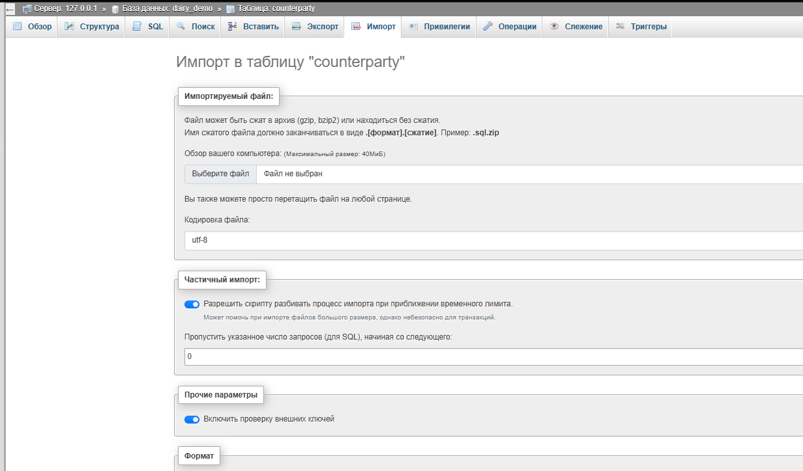

/// caption
Рисунок 35 – Переход во вкладку Import
///

---

### Настройка импорта

1. В разделе **File to import**:

   * нажмите **Choose file**
   * выберите `Заказчики.csv`

2. Format:

   * выберите **CSV**

3. Отметьте параметры:

   * ✔ The first line of the file contains the table column names
   * Character set of the file: **utf-8**

4. Укажите разделитель:

   * `,` или `;` (в зависимости от файла)

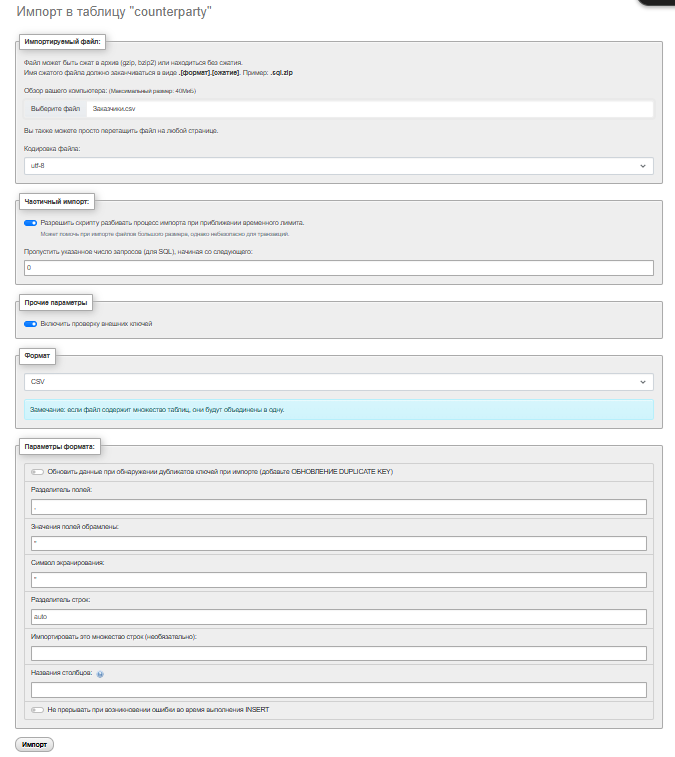

/// caption
Рисунок 36 – Настройка параметров CSV-импорта
///

5. Нажмите **Go**.

---

## 4.3. Проверка результата

После успешного импорта появится сообщение:

> Import has been successfully finished

---

### Проверка через интерфейс

1. Откройте таблицу `counterparty`.
2. Перейдите во вкладку **Browse**.


/// caption
Рисунок 37 – Просмотр импортированных данных
///

3. Убедитесь, что:

   * записи добавлены,
   * значения корректно распределены по колонкам,
   * нет NULL там, где не должно быть.

---

## 4.4. Если импорт не проходит

### Частые причины

| Ошибка             | Причина                    | Решение                 |
| ------------------ | -------------------------- | ----------------------- |
| Неверная кодировка | Файл не в UTF-8            | Пересохранить как UTF-8 |
| Смещение столбцов  | Неправильный разделитель   | Проверить `,` или `;`   |
| Дублирование PK    | Повторяются `id`           | Удалить дубликаты       |
| Тип boolean        | В CSV указано `true/false` | Использовать `1/0`      |

---

## 4.5. Результат

После выполнения раздела:

* таблица `counterparty` заполнена данными;
* структура не нарушена;
* внешние ключи сохраняют целостность;
* используется только графический интерфейс.


## 4.6. Заполнение таблиц

> Внимание! Заполните таблицы логическими данными, чтобы можно было все правильно отработать. 

---

## 5. Проверка своей базы данных

Для проверки своей БД после создания таблиц сформируйте визуальную проверку структуры (таблицы/связи) средствами интерфейса.

### 5.1. Проверка таблиц и связей

1. Откройте вкладку **Structure** у базы данных `dairy_demo`
2. Убедитесь, что все таблицы присутствуют
3. Для таблиц со связями откройте **Structure → Relation view** и проверьте внешние ключи
4. Расставьте все элементы, чтобы они не пересекались 

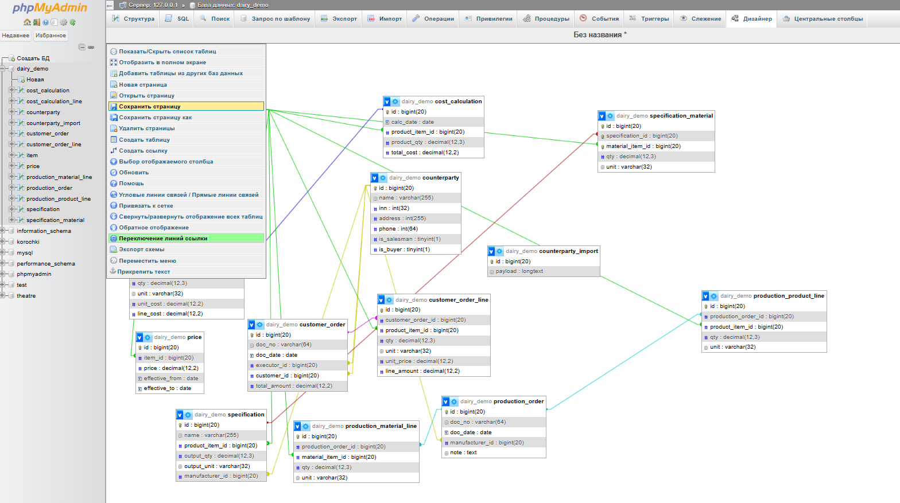

/// caption
Рисунок 38 – Проверка структуры и связей
///

### 5.3. Сохранение результата проверки

Результат проверки можно зафиксировать скриншотами структуры БД и вкладки `Relation view` (как подтверждение наличия PK/FK).


/// caption
Рисунок 39 – Пример фиксации результата (выгрузка в pdf)
///

### 5.4. Как получить файл

1. В phpMyAdmin выберите БД `dairy_demo`
2. Вкладка **Export**
3. Format: **SQL**
4. Выполните экспорт и сохраните файл как `dairy_demo_mysql.sql`

## 6. Скачать пример готовой базы данных

- `dairy_demo.sql`

👉 [dairy_demo.sql](../assets/files//dairy_demo.sql)
 
