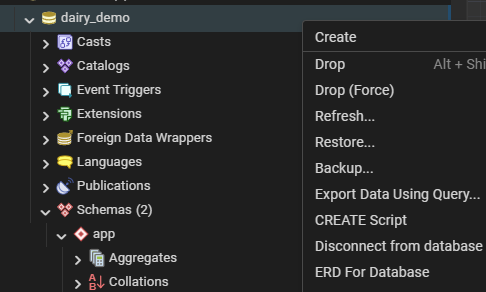
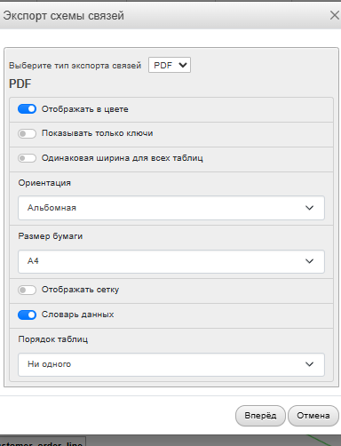
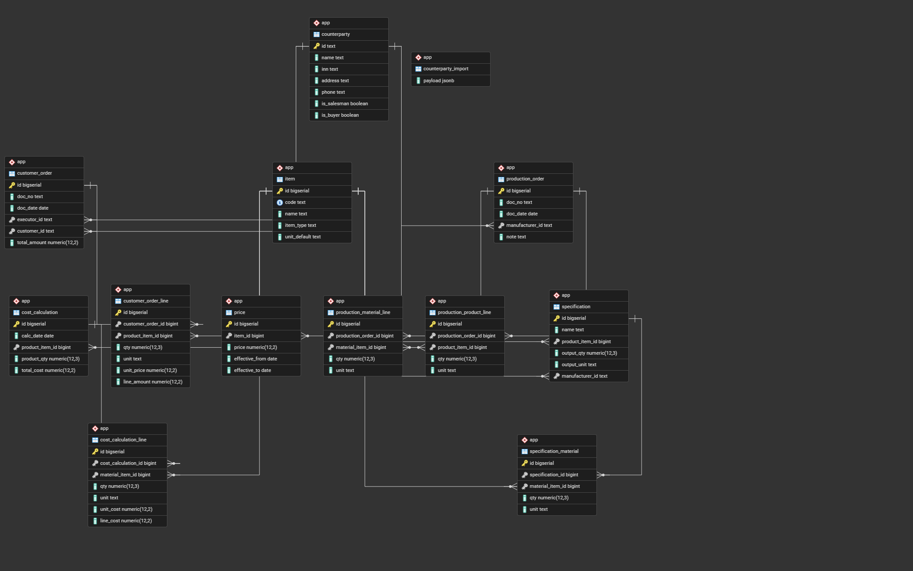

# Модуль 2. Разработка базы данных по ER-диаграмме (MySQL через phpMyAdmin)

**Цель:** создать БД и таблицы по ER, настроить PK/FK/ограничения, затем импортировать `Заказчики.json`.

---

## 0. Важно перед стартом

* Везде ниже используется один вариант выполнения:  * **SQL-запрос (DDL/DML)**

* Рекомендуемая структура: используем одну БД `dairy_demo`.
  Отдельный namespace `app` не требуется — все таблицы создаются внутри базы данных.


---

## 1. Создание базы данных

### Создание БД через SQL

```sql
CREATE DATABASE IF NOT EXISTS dairy_demo
  DEFAULT CHARACTER SET utf8mb4
  DEFAULT COLLATE utf8mb4_unicode_ci;
```

Подключение:

* phpMyAdmin: выбрать БД `dairy_demo` в дереве слева

---

## 2. Подготовка окружения в phpMyAdmin

1. Откройте phpMyAdmin
2. В левой панели выберите БД `dairy_demo`
3. Перейдите на вкладку **SQL** (для выполнения DDL/DML)

---

## 3. Создание таблиц по ER-диаграмме (каждая — GUI или SQL)

> Ниже перечислены основные сущности. Для каждой — 2 способа.

> Важно: для внешних ключей используйте движок **InnoDB** (обычно по умолчанию).

---

### 3.1. COUNTERPARTY (Контрагент)

```sql
CREATE TABLE IF NOT EXISTS counterparty (
    id           BIGINT NOT NULL AUTO_INCREMENT,
    name         VARCHAR(255) NOT NULL,
    inn          VARCHAR(32) NULL,
    address      VARCHAR(255) NULL,
    phone        VARCHAR(64) NULL,
    is_salesman  TINYINT(1) NOT NULL DEFAULT 0,
    is_buyer     TINYINT(1) NOT NULL DEFAULT 0
) ENGINE=InnoDB;
```

---

### 3.2. ITEM (Номенклатура)

```sql
CREATE TABLE IF NOT EXISTS item (
    id           BIGINT NOT NULL AUTO_INCREMENT,
    code         VARCHAR(64) UNIQUE,
    name         VARCHAR(255) NOT NULL,
    item_type    ENUM('product','material') NOT NULL,
    unit_default VARCHAR(32) NULL,
    PRIMARY KEY (id)
) ENGINE=InnoDB;
```

---

### 3.3. PRICE (Прайс-лист)

```sql
CREATE TABLE IF NOT EXISTS price (
    id             BIGINT NOT NULL AUTO_INCREMENT,
    item_id        BIGINT NOT NULL,
    price          DECIMAL(12,2) NOT NULL,
    effective_from DATE NULL,
    effective_to   DATE NULL,
    PRIMARY KEY (id),
    KEY idx_price_item (item_id),
    CONSTRAINT fk_price_item
      FOREIGN KEY (item_id) REFERENCES item(id)
      ON UPDATE CASCADE
      ON DELETE RESTRICT
) ENGINE=InnoDB;
```

> Примечание по ограничениям:

* `price >= 0` и проверка дат могут быть добавлены через `CHECK` в MySQL 8.0.16+.
* Если версия ниже — контролируйте в приложении/вводе.

---

### 3.4. SPECIFICATION и SPECIFICATION_MATERIAL

#### SPECIFICATION

```sql
CREATE TABLE IF NOT EXISTS specification (
    id              BIGINT NOT NULL AUTO_INCREMENT,
    name            VARCHAR(255) NOT NULL,
    product_item_id BIGINT NOT NULL,
    output_qty      DECIMAL(12,3) NOT NULL DEFAULT 1.000,
    output_unit     VARCHAR(32) NULL,
    manufacturer_id BIGINT NULL,
    PRIMARY KEY (id),
    KEY idx_spec_product (product_item_id),
    KEY idx_spec_manufacturer (manufacturer_id),
    CONSTRAINT fk_spec_product
      FOREIGN KEY (product_item_id) REFERENCES item(id)
      ON UPDATE CASCADE
      ON DELETE RESTRICT,
    CONSTRAINT fk_spec_manufacturer
      FOREIGN KEY (manufacturer_id) REFERENCES counterparty(id)
      ON UPDATE CASCADE
      ON DELETE RESTRICT
) ENGINE=InnoDB DEFAULT CHARSET=utf8mb4 COLLATE=utf8mb4_unicode_ci;

```

#### SPECIFICATION_MATERIAL

```sql
CREATE TABLE IF NOT EXISTS specification_material (
    id               BIGINT NOT NULL AUTO_INCREMENT,
    specification_id BIGINT NOT NULL,
    material_item_id BIGINT NOT NULL,
    qty              DECIMAL(12,3) NOT NULL,
    unit             VARCHAR(32) NULL,
    PRIMARY KEY (id),
    UNIQUE KEY uq_spec_material (specification_id, material_item_id),
    KEY idx_specmat_material (material_item_id),
    CONSTRAINT fk_specmat_spec
      FOREIGN KEY (specification_id) REFERENCES specification(id)
      ON UPDATE CASCADE
      ON DELETE CASCADE,
    CONSTRAINT fk_specmat_material
      FOREIGN KEY (material_item_id) REFERENCES item(id)
      ON UPDATE CASCADE
      ON DELETE RESTRICT
) ENGINE=InnoDB;
```

---

### 3.5. PRODUCTION_ORDER, PRODUCTION_PRODUCT_LINE, PRODUCTION_MATERIAL_LINE

```sql
CREATE TABLE IF NOT EXISTS production_order (
    id              BIGINT NOT NULL AUTO_INCREMENT,
    doc_no          VARCHAR(64) NOT NULL,
    doc_date        DATE NULL,
    manufacturer_id BIGINT NULL,
    note            TEXT NULL,
    PRIMARY KEY (id),
    KEY idx_prodorder_manufacturer (manufacturer_id),
    CONSTRAINT fk_prodorder_manufacturer
      FOREIGN KEY (manufacturer_id) REFERENCES counterparty(id)
      ON UPDATE CASCADE
      ON DELETE RESTRICT
) ENGINE=InnoDB DEFAULT CHARSET=utf8mb4 COLLATE=utf8mb4_unicode_ci;


CREATE TABLE IF NOT EXISTS production_product_line (
    id                  BIGINT NOT NULL AUTO_INCREMENT,
    production_order_id BIGINT NOT NULL,
    product_item_id     BIGINT NOT NULL,
    qty                 DECIMAL(12,3) NOT NULL,
    unit                VARCHAR(32) NULL,
    PRIMARY KEY (id),
    KEY idx_prodprod_order (production_order_id),
    KEY idx_prodprod_item (product_item_id),
    CONSTRAINT fk_prodprod_order
      FOREIGN KEY (production_order_id) REFERENCES production_order(id)
      ON UPDATE CASCADE
      ON DELETE CASCADE,
    CONSTRAINT fk_prodprod_item
      FOREIGN KEY (product_item_id) REFERENCES item(id)
      ON UPDATE CASCADE
      ON DELETE RESTRICT
) ENGINE=InnoDB;

CREATE TABLE IF NOT EXISTS production_material_line (
    id                  BIGINT NOT NULL AUTO_INCREMENT,
    production_order_id BIGINT NOT NULL,
    material_item_id    BIGINT NOT NULL,
    qty                 DECIMAL(12,3) NOT NULL,
    unit                VARCHAR(32) NULL,
    PRIMARY KEY (id),
    KEY idx_prodmat_order (production_order_id),
    KEY idx_prodmat_item (material_item_id),
    CONSTRAINT fk_prodmat_order
      FOREIGN KEY (production_order_id) REFERENCES production_order(id)
      ON UPDATE CASCADE
      ON DELETE CASCADE,
    CONSTRAINT fk_prodmat_item
      FOREIGN KEY (material_item_id) REFERENCES item(id)
      ON UPDATE CASCADE
      ON DELETE RESTRICT
) ENGINE=InnoDB;
```

---

### 3.6. CUSTOMER_ORDER и CUSTOMER_ORDER_LINE

```sql
CREATE TABLE IF NOT EXISTS customer_order (
    id           BIGINT NOT NULL AUTO_INCREMENT,
    doc_no       VARCHAR(64) NOT NULL,
    doc_date     DATE NULL,
    executor_id  BIGINT NULL,
    customer_id  BIGINT NULL,
    total_amount DECIMAL(12,2) NULL,
    PRIMARY KEY (id),
    KEY idx_custorder_executor (executor_id),
    KEY idx_custorder_customer (customer_id),
    CONSTRAINT fk_custorder_executor
      FOREIGN KEY (executor_id) REFERENCES counterparty(id)
      ON UPDATE CASCADE
      ON DELETE RESTRICT,
    CONSTRAINT fk_custorder_customer
      FOREIGN KEY (customer_id) REFERENCES counterparty(id)
      ON UPDATE CASCADE
      ON DELETE RESTRICT
) ENGINE=InnoDB DEFAULT CHARSET=utf8mb4 COLLATE=utf8mb4_unicode_ci;


CREATE TABLE IF NOT EXISTS customer_order_line (
    id                BIGINT NOT NULL AUTO_INCREMENT,
    customer_order_id BIGINT NOT NULL,
    product_item_id   BIGINT NOT NULL,
    qty               DECIMAL(12,3) NOT NULL,
    unit              VARCHAR(32) NULL,
    unit_price        DECIMAL(12,2) NULL,
    line_amount       DECIMAL(12,2) NULL,
    PRIMARY KEY (id),
    KEY idx_custline_order (customer_order_id),
    KEY idx_custline_item (product_item_id),
    CONSTRAINT fk_custline_order
      FOREIGN KEY (customer_order_id) REFERENCES customer_order(id)
      ON UPDATE CASCADE
      ON DELETE CASCADE,
    CONSTRAINT fk_custline_item
      FOREIGN KEY (product_item_id) REFERENCES item(id)
      ON UPDATE CASCADE
      ON DELETE RESTRICT
) ENGINE=InnoDB;
```

---

### 3.7. COST_CALCULATION и COST_CALCULATION_LINE

```sql
CREATE TABLE IF NOT EXISTS cost_calculation (
    id              BIGINT NOT NULL AUTO_INCREMENT,
    calc_date       DATE NULL,
    product_item_id BIGINT NOT NULL,
    product_qty     DECIMAL(12,3) NOT NULL DEFAULT 1.000,
    total_cost      DECIMAL(12,2) NULL,
    PRIMARY KEY (id),
    KEY idx_costcalc_product (product_item_id),
    CONSTRAINT fk_costcalc_product
      FOREIGN KEY (product_item_id) REFERENCES item(id)
      ON UPDATE CASCADE
      ON DELETE RESTRICT
) ENGINE=InnoDB;

CREATE TABLE IF NOT EXISTS cost_calculation_line (
    id                  BIGINT NOT NULL AUTO_INCREMENT,
    cost_calculation_id BIGINT NOT NULL,
    material_item_id    BIGINT NOT NULL,
    qty                 DECIMAL(12,3) NOT NULL,
    unit                VARCHAR(32) NULL,
    unit_cost           DECIMAL(12,2) NULL,
    line_cost           DECIMAL(12,2) NULL,
    PRIMARY KEY (id),
    KEY idx_costline_calc (cost_calculation_id),
    KEY idx_costline_item (material_item_id),
    CONSTRAINT fk_costline_calc
      FOREIGN KEY (cost_calculation_id) REFERENCES cost_calculation(id)
      ON UPDATE CASCADE
      ON DELETE CASCADE,
    CONSTRAINT fk_costline_item
      FOREIGN KEY (material_item_id) REFERENCES item(id)
      ON UPDATE CASCADE
      ON DELETE RESTRICT
) ENGINE=InnoDB;
```

---

## 4. Импорт `Заказчики.json` (GUI или SQL)

### Шаг 1. Staging-таблица

```sql
CREATE TABLE IF NOT EXISTS counterparty_import (
    id      BIGINT NOT NULL AUTO_INCREMENT PRIMARY KEY,
    payload JSON NOT NULL
) ENGINE=InnoDB;
```

---

### Шаг 2. Загрузка данных из `Заказчики.json`

#### Ключевой момент (важно)

В phpMyAdmin нет команды типа `\copy`.
Импорт JSON делается через:

* **вариант A (рекомендуется):** преобразовать JSON в SQL (`INSERT`) и импортировать как `.sql`
* **вариант B (MySQL 8+):** загрузить JSON в staging и распаковать через `JSON_TABLE`

---

#### Правильный вариант №1 (РЕКОМЕНДУЕТСЯ): JSON → SQL и импорт через phpMyAdmin

1. Преобразуйте `Заказчики.json` в файл `counterparty_seed.sql` вида:

```sql
INSERT INTO counterparty (id, name, inn, address, phone, is_salesman, is_buyer) VALUES
('C001','ООО Ромашка','1234567890','г. ...','+7... ',1,0),
('C002','ИП Иванов',NULL,'г. ...',NULL,0,1);
```

2. В phpMyAdmin:

   * выберите БД `dairy_demo`
   * вкладка **Import**
   * загрузите `counterparty_seed.sql`
   * выполните импорт

---

#### Правильный вариант №2 (MySQL 8+): загрузка JSON в staging и распаковка

##### 2.1. Вставка JSON в staging

Откройте файл `Заказчики.json`, скопируйте содержимое (массив `[...]`) и выполните:

```sql
INSERT INTO counterparty_import(payload)
VALUES (CAST('[
  {"id":"C001","name":"ООО Ромашка","inn":"123","address":"...","phone":"...","salesman":true,"buyer":false}
]' AS JSON));
```

> Если внутри JSON встречаются кавычки и спецсимволы, вставка может потребовать экранирования.
> Для экзамена чаще всего удобнее вариант №1 (JSON → SQL).

##### 2.2. Распаковка массива JSON в таблицу `counterparty`

```sql
INSERT INTO counterparty (id, name, inn, address, phone, is_salesman, is_buyer)
SELECT
  jt.id,
  jt.name,
  NULLIF(jt.inn, ''),
  NULLIF(COALESCE(jt.address, jt.addres), ''),
  NULLIF(jt.phone, ''),
  IFNULL(jt.salesman, 0),
  IFNULL(jt.buyer, 0)
FROM counterparty_import ci
JOIN JSON_TABLE(ci.payload, '$[*]' COLUMNS (
  id       BIGINT PATH '$.id',
  name     VARCHAR(255) PATH '$.name',
  inn      VARCHAR(32)  PATH '$.inn'      NULL ON ERROR,
  address  VARCHAR(255) PATH '$.address'  NULL ON ERROR,
  addres   VARCHAR(255) PATH '$.addres'   NULL ON ERROR,
  phone    VARCHAR(64)  PATH '$.phone'    NULL ON ERROR,
  salesman TINYINT(1)   PATH '$.salesman' DEFAULT 0 ON EMPTY DEFAULT 0 ON ERROR,
  buyer    TINYINT(1)   PATH '$.buyer'    DEFAULT 0 ON EMPTY DEFAULT 0 ON ERROR
)) AS jt
ON DUPLICATE KEY UPDATE
  name        = VALUES(name),
  inn         = VALUES(inn),
  address     = VALUES(address),
  phone       = VALUES(phone),
  is_salesman = VALUES(is_salesman),
  is_buyer    = VALUES(is_buyer);
```

---

### Шаг 3. Проверка

```sql
SELECT COUNT(*) FROM counterparty;
SELECT * FROM counterparty ORDER BY id LIMIT 10;
```

> Внимание! Заполните таблицы логическими данными, чтобы можно было все правильно отработать. 

---

## 5. Проверка своей базы данных

Для проверки своей БД после создания таблиц:


### 5.1. Выбрать БД

1. Откройте phpMyAdmin и выберите БД `dairy_demo`
2. Убедитесь, что все таблицы созданы и связи (FK) присутствуют


  

   /// caption
   Рисунок 1 – Проверка своей базы данных
   ///

### 5.2. Создание ER-диаграммы


```sql
SHOW TABLES;

SHOW CREATE TABLE counterparty;
SHOW CREATE TABLE customer_order_line;
```

> Если доступен режим “Designer” в phpMyAdmin — можно визуально посмотреть связи между таблицами.

  

   /// caption
   Рисунок 2 – Создание ER-диаграммы
   ///

### 5.3. Сохранение диаграммы

**Как получить файл:**

1. phpMyAdmin → выбрать БД `dairy_demo`
2. Вкладка **Export**
3. Format: **SQL**
4. Export → сохранить файл как `dairy_demo_mysql.sql`

   

   /// caption
   Рисунок 3 – Пример сохраненной диаграммы
   ///

## 6. Скачать пример готовой базы данных

- `dairy_demo.sql`

👉 [dairy_demo.sql](../assets/files//dairy_demo.sql)
 
