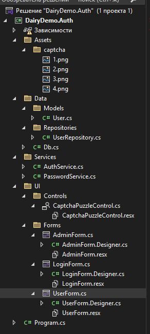
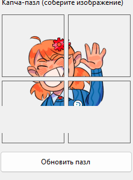
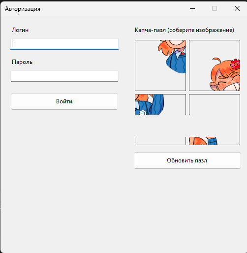
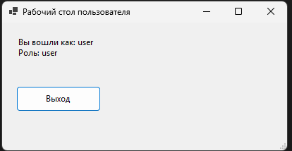
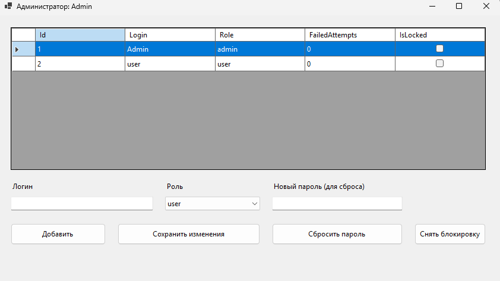

# Модуль 4. Разработка информационной системы


## 1. Доработка БД: таблица `users` и ограничения

### 1.1. Создаём таблицу пользователей (MySQL)

Рекомендации по хранению:

* `login` (уникальный)
* `password_hash` (BCrypt-хэш, пароль в открытом виде **не** хранить)
* `role` (`admin`/`user`)
* `failed_attempts` и `is_locked` (3 подряд — блок)
* метки времени для аудита

```sql
CREATE TABLE IF NOT EXISTS users (
    id              BIGINT NOT NULL AUTO_INCREMENT,
    login           VARCHAR(64) NOT NULL,
    password_hash   VARCHAR(255) NOT NULL,
    role            ENUM('admin','user') NOT NULL DEFAULT 'user',
    failed_attempts INT NOT NULL DEFAULT 0,
    is_locked       TINYINT(1) NOT NULL DEFAULT 0,
    created_at      TIMESTAMP NOT NULL DEFAULT CURRENT_TIMESTAMP,
    updated_at      TIMESTAMP NOT NULL DEFAULT CURRENT_TIMESTAMP ON UPDATE CURRENT_TIMESTAMP,

    PRIMARY KEY (id),
    UNIQUE KEY uq_users_login (login),
    CHECK (failed_attempts >= 0)
) ENGINE=InnoDB DEFAULT CHARSET=utf8mb4 COLLATE=utf8mb4_unicode_ci;

CREATE INDEX ix_users_login ON users(login);
```

> Примечание: `CHECK` реально контролируется в MySQL 8.0.16+. Если версия ниже — контролируйте `failed_attempts` на уровне приложения.

### 1.2. Начальный администратор (seed)

Пароль правильно хранить как BCrypt-хэш, но для старта можно:

* временно поставить “заглушку”, потом заменить на BCrypt,
* либо один раз сгенерировать BCrypt и вставить.

### Вариант A: вставка пользователей (MySQL)

MySQL-эквивалент `ON CONFLICT DO NOTHING` — это `INSERT IGNORE` или `ON DUPLICATE KEY UPDATE`.

**Рекомендую так (не создаёт дубль, но и не ломает):**

```sql
INSERT INTO users (login, password_hash, role)
VALUES ('Admin', 'admin', 'admin')
ON DUPLICATE KEY UPDATE login = login;

INSERT INTO users (login, password_hash, role)
VALUES ('User', 'user', 'user')
ON DUPLICATE KEY UPDATE login = login;
```

> Важно: строки `'admin'` и `'user'` — это **НЕ BCrypt-хэши**. Это временные “заглушки”, которые нужно заменить на нормальные BCrypt-хэши перед сдачей/использованием.


👉 [Пример базы данных с добавленной таблицей](../assets/files//dairy_demo%20(3).sql)

---

## 3. Архитектура WinForms-проекта (минимально, но чисто)

### 3.1. Создать проект

* Visual Studio → **Windows Forms App (.NET)** (лучше .NET 8/9)
* Имя: `DairyDemo.Auth` (или ваше)

### 3.2. NuGet пакеты 

**Обязательно:**

* `MySqlConnector` (рекомендуемый драйвер для MySQL в .NET)
* `BCrypt.Net-Next`

**Опционально:**

* `Dapper`


---

### 3.3. Структура проекта (как должно лежать)

```
DairyDemo.Auth/
  Program.cs
  Assets/
    captcha/
        1.png
        2.png
        3.png
        4.png
  Data/
    Db.cs
    Models/
      User.cs
    Repositories/
      UserRepository.cs

  Services/
    AuthService.cs
    PasswordService.cs

  UI/
    Controls/
      CaptchaPuzzleControl.cs
      CaptchaPuzzleControl.Designer.cs  (можно не создавать вручную)
    Forms/
      LoginForm.cs
      LoginForm.Designer.cs             (можно не создавать вручную)
      AdminForm.cs
      AdminForm.Designer.cs             (можно не создавать вручную)
      UserForm.cs
      UserForm.Designer.cs              (можно не создавать вручную)
```

**Важно про Designer-файлы:**
WinForms обычно генерирует их сам через визуальный конструктор. Все элементы в папке форма создается через WindowsForm.


   

   /// caption
   Рисунок  1 – Структура проекта 
   ///


> Картинки беруться из архива и для них потребуются дополнительные настройки см. пункт 4.1.

---

## 4.  Работа с проектом 

### 4.1. Настройка картинок 

Для **каждого файла** `1.png`, `2.png`, `3.png`, `4.png`:

1. Клик правой кнопкой → **Properties**
2. Установить:

| Свойство                     | Значение                            |
| ---------------------------- | ----------------------------------- |
| **Build Action**             | `Content` или `Содержимое`                           |
| **Copy to Output Directory** | `Copy if newer`  или `Копировать всегда` |

! Повторить для всех четырёх PNG.

---

### 4.2. Вывод и копирование хэша пароля с использованием TextBox

В процессе администрирования пользователей может возникнуть необходимость получить значение хэша пароля для последующего использования. 
Использование стандартного окна `MessageBox` или `Console.WriteLine()` не позволяет выделять и копировать текст, поэтому для этих целей применяется временная форма с многострочным элементом управления `TextBox`.

#### Реализация временной формы для отображения хэша пароля

При генерации хэша пароля (например, с использованием алгоритма BCrypt) значение выводится в текстовое поле, доступное для копирования:

```csharp
var hash = BCrypt.Net.BCrypt.HashPassword("admin");

var tb = new TextBox
{
    Multiline = true,
    ReadOnly = true,
    Dock = DockStyle.Fill,
    Text = hash
};

var form = new Form
{
    Text = "Хэш пароля",
    Width = 600,
    Height = 200,
    StartPosition = FormStartPosition.CenterScreen
};

form.Controls.Add(tb);
form.ShowDialog();

```

В открывшемся окне пользователь может выделить текст хэша пароля и скопировать его в буфер обмена стандартными средствами операционной системы.

#### Использование хэша пароля для обновления данных в базе данных

Скопированный хэш пароля применяется для обновления записи пользователя в таблице `users`. Также одновременно выполняется сброс счётчика неудачных попыток входа и снятие блокировки учётной записи.

Пример SQL-запроса:

```sql
update app.users
set password_hash = '<ВСТАВЬТЕ_ХЭШ>',
    failed_attempts = 0,
    is_locked = false
where login = 'Admin';
```

Данный запрос:

* устанавливает корректный BCrypt-хэш пароля;
* сбрасывает количество неудачных попыток входа;
* снимает блокировку учётной записи администратора.

После выполнения запроса пользователь `Admin` cможет успешно пройти аутентификацию в приложении.

 
---


### 4.3. Data: `Data/Db.cs`


Для централизованного и унифицированного доступа к базе данных **MySQL** в проекте используется отдельный статический класс `Db`, расположенный в пространстве имён `DairyDemo.Auth.Data`.

Данный класс инкапсулирует параметры подключения к СУБД MySQL и предоставляет единый метод для создания соединения, что:

* упрощает сопровождение проекта;
* исключает дублирование строки подключения;
* позволяет быстро изменить параметры подключения без изменения бизнес-логики;
* обеспечивает единообразный доступ к БД во всех слоях приложения.

---

## Назначение класса `Db`

Класс `Db` выполняет следующие функции:

* хранит строку подключения к базе данных **MySQL**;
* предоставляет централизованный способ создания объекта `MySqlConnection`;
* инкапсулирует параметры подключения (сервер, порт, база, пользователь, пароль);
* обеспечивает единый источник конфигурации доступа к БД.

```csharp
using MySqlConnector;

namespace DairyDemo.Auth.Data;

public static class Db
{
    // Пример для XAMPP:
    // user: root
    // password: (часто пустой, если вы не меняли)
    // host: localhost
    // database: dairy_demo
    public static string ConnectionString =
        "Server=localhost;Port=3306;Database=dairy_demo;Uid=root;Pwd=;SslMode=None;";

    public static MySqlConnection CreateConnection()
        => new MySqlConnection(ConnectionString);
}
```

## Пояснение параметров строки подключения (MySQL)

В строке подключения используются следующие параметры:

* `Server` — адрес сервера MySQL (обычно `localhost`);
* `Port` — порт MySQL (по умолчанию `3306`);
* `Database` — имя базы данных (например, `dairy_demo`);
* `Uid` — имя пользователя MySQL (например, `root`);
* `Pwd` — пароль пользователя MySQL;
* `SslMode` — режим SSL (для локального XAMPP обычно `None`).
---

### 4.4. Data Model: `Data/Models/User.cs`

Для представления данных пользователя в приложении используется модель `User`, расположенная в каталоге `Data/Models`. Данная модель отражает структуру записи таблицы `users`  и применяется при передаче данных между слоями доступа к данным, бизнес-логики и пользовательского интерфейса.

#### Назначение модели `User`

Модель `User` предназначена для:

* хранения данных пользователя, полученных из базы данных;
* передачи информации о пользователе между сервисами приложения;
* определения прав доступа пользователя на основе его роли;
* реализации логики блокировки учётной записи.

Класс является `sealed`, что запрещает наследование и гарантирует
использование модели только в исходном виде, без изменения структуры
в других частях приложения.

```csharp
namespace DairyDemo.Auth.Data.Models;

public sealed class User
{
    public long Id { get; init; }
    public string Login { get; init; } = "";
    public string PasswordHash { get; init; } = "";
    public string Role { get; init; } = "user"; // admin | user
    public int FailedAttempts { get; init; }
    public bool IsLocked { get; init; }
}
```

#### Пояснение свойств модели

* `Id` — уникальный идентификатор пользователя (первичный ключ таблицы);
* `Login` — логин пользователя, используемый для авторизации;
* `PasswordHash` — хэш пароля пользователя, сохранённый в базе данных
  (в формате BCrypt);
* `Role` — роль пользователя в системе:

  * `admin` — администратор;
  * `user` — обычный пользователь;
* `FailedAttempts` — количество подряд неудачных попыток входа;
* `IsLocked` — признак блокировки учётной записи пользователя.

---

### 4.5. Repository: `Data/Repositories/UserRepository.cs`

Для изоляции логики доступа к данным и взаимодействия с базой данных
MySQL в проекте используется репозиторий `UserRepository`,
расположенный в каталоге `Data/Repositories`.

Репозиторий реализует операции чтения и изменения данных пользователей,
инкапсулируя SQL-запросы и работу с драйвером `Npgsql`. Такой подход
позволяет отделить бизнес-логику приложения от деталей хранения данных.

```csharp
using System;
using System.Collections.Generic;
using System.Threading.Tasks;
using DairyDemo.Auth.Data.Models;
using MySqlConnector;

namespace DairyDemo.Auth.Data.Repositories;

public sealed class UserRepository
{
    public async Task<User?> GetByLoginAsync(string login)
    {
        await using var conn = Db.CreateConnection();
        await conn.OpenAsync();

        const string sql = @"
SELECT id, login, password_hash, role, failed_attempts, is_locked
FROM users
WHERE login = @login
LIMIT 1;
";
        await using var cmd = new MySqlCommand(sql, conn);
        cmd.Parameters.AddWithValue("@login", login);

        await using var r = await cmd.ExecuteReaderAsync();
        if (!await r.ReadAsync()) return null;

        return new User
        {
            Id = r.GetInt64("id"),
            Login = r.GetString("login"),
            PasswordHash = r.GetString("password_hash"),
            Role = r.GetString("role"),
            FailedAttempts = r.GetInt32("failed_attempts"),
            IsLocked = r.GetBoolean("is_locked")
        };
    }

    public async Task<List<User>> GetAllAsync()
    {
        await using var conn = Db.CreateConnection();
        await conn.OpenAsync();

        const string sql = @"
SELECT id, login, password_hash, role, failed_attempts, is_locked
FROM users
ORDER BY id;
";
        await using var cmd = new MySqlCommand(sql, conn);

        var list = new List<User>();
        await using var r = await cmd.ExecuteReaderAsync();
        while (await r.ReadAsync())
        {
            list.Add(new User
            {
                Id = r.GetInt64("id"),
                Login = r.GetString("login"),
                PasswordHash = r.GetString("password_hash"),
                Role = r.GetString("role"),
                FailedAttempts = r.GetInt32("failed_attempts"),
                IsLocked = r.GetBoolean("is_locked")
            });
        }

        return list;
    }

    public async Task<bool> ExistsLoginAsync(string login)
    {
        await using var conn = Db.CreateConnection();
        await conn.OpenAsync();

        const string sql = @"SELECT 1 FROM users WHERE login = @login LIMIT 1;";
        await using var cmd = new MySqlCommand(sql, conn);
        cmd.Parameters.AddWithValue("@login", login);

        var res = await cmd.ExecuteScalarAsync();
        return res != null;
    }

    public async Task AddUserAsync(string login, string passwordHash, string role)
    {
        await using var conn = Db.CreateConnection();
        await conn.OpenAsync();

        const string sql = @"
INSERT INTO users (login, password_hash, role)
VALUES (@login, @hash, @role);
";
        await using var cmd = new MySqlCommand(sql, conn);
        cmd.Parameters.AddWithValue("@login", login);
        cmd.Parameters.AddWithValue("@hash", passwordHash);
        cmd.Parameters.AddWithValue("@role", role);

        await cmd.ExecuteNonQueryAsync();
    }

    public async Task UpdateUserAsync(long id, string login, string role)
    {
        await using var conn = Db.CreateConnection();
        await conn.OpenAsync();

        const string sql = @"
UPDATE users
SET login = @login,
    role  = @role
WHERE id = @id;
";
        await using var cmd = new MySqlCommand(sql, conn);
        cmd.Parameters.AddWithValue("@id", id);
        cmd.Parameters.AddWithValue("@login", login);
        cmd.Parameters.AddWithValue("@role", role);

        await cmd.ExecuteNonQueryAsync();
    }

    public async Task UpdatePasswordAsync(long id, string passwordHash)
    {
        await using var conn = Db.CreateConnection();
        await conn.OpenAsync();

        const string sql = @"UPDATE users SET password_hash = @hash WHERE id = @id;";
        await using var cmd = new MySqlCommand(sql, conn);
        cmd.Parameters.AddWithValue("@id", id);
        cmd.Parameters.AddWithValue("@hash", passwordHash);

        await cmd.ExecuteNonQueryAsync();
    }

    public async Task IncrementFailedAttemptsAndLockIfNeededAsync(long userId)
    {
        await using var conn = Db.CreateConnection();
        await conn.OpenAsync();

        // MySQL: boolean обычно хранится как TINYINT(1), поэтому выставляем 1/0.
        const string sql = @"
UPDATE users
SET failed_attempts = failed_attempts + 1,
    is_locked = CASE
        WHEN (failed_attempts + 1) >= 3 THEN 1
        ELSE is_locked
    END
WHERE id = @id;
";
        await using var cmd = new MySqlCommand(sql, conn);
        cmd.Parameters.AddWithValue("@id", userId);

        await cmd.ExecuteNonQueryAsync();
    }

    public async Task ResetFailedAttemptsAsync(long userId)
    {
        await using var conn = Db.CreateConnection();
        await conn.OpenAsync();

        const string sql = @"UPDATE users SET failed_attempts = 0 WHERE id = @id;";
        await using var cmd = new MySqlCommand(sql, conn);
        cmd.Parameters.AddWithValue("@id", userId);

        await cmd.ExecuteNonQueryAsync();
    }

    public async Task UnlockAsync(long userId)
    {
        await using var conn = Db.CreateConnection();
        await conn.OpenAsync();

        const string sql = @"UPDATE users SET failed_attempts = 0, is_locked = 0 WHERE id = @id;";
        await using var cmd = new MySqlCommand(sql, conn);
        cmd.Parameters.AddWithValue("@id", userId);

        await cmd.ExecuteNonQueryAsync();
    }

    // (опционально) Удобно получать ID последней вставки при добавлении пользователя.
    // public async Task<long> AddUserAndReturnIdAsync(string login, string passwordHash, string role)
    // {
    //     await using var conn = Db.CreateConnection();
    //     await conn.OpenAsync();
    //
    //     const string sql = @"
    // INSERT INTO users (login, password_hash, role)
    // VALUES (@login, @hash, @role);
    // SELECT LAST_INSERT_ID();
    // ";
    //     await using var cmd = new MySqlCommand(sql, conn);
    //     cmd.Parameters.AddWithValue("@login", login);
    //     cmd.Parameters.AddWithValue("@hash", passwordHash);
    //     cmd.Parameters.AddWithValue("@role", role);
    //
    //     var id = await cmd.ExecuteScalarAsync();
    //     return Convert.ToInt64(id);
    // }
}

```

#### Назначение репозитория `UserRepository`

Репозиторий `UserRepository` предназначен для:

* получения данных пользователей из базы данных;
* добавления и изменения записей пользователей;
* проверки уникальности логина;
* управления паролями пользователей;
* учёта неудачных попыток входа;
* автоматической блокировки и разблокировки учётных записей.

#### Реализуемые операции

В репозитории реализованы следующие группы операций:

* **Чтение данных**:

    * получение пользователя по логину;
    * получение списка всех пользователей;
    
* **Управление пользователями**:

    * добавление нового пользователя;
    * обновление логина и роли;
    * изменение пароля;

* **Безопасность и блокировка**:

    * увеличение счётчика неудачных попыток входа;
    * автоматическая блокировка при достижении лимита попыток;
    * сброс счётчика попыток;
    * снятие блокировки учётной записи.

---


### 4.6. Services: `Services/PasswordService.cs`

Для обеспечения безопасного хранения и проверки паролей пользователей
в проекте реализован сервис `PasswordService`, расположенный в каталоге
`Services`. Данный сервис инкапсулирует логику хэширования и проверки
паролей и используется другими компонентами приложения (в частности,
сервисом авторизации).

```csharp
namespace DairyDemo.Auth.Services;

public sealed class PasswordService
{
    public string HashPassword(string password)
        => BCrypt.Net.BCrypt.HashPassword(password);

    public bool Verify(string password, string hash)
    {
        if (string.IsNullOrWhiteSpace(hash))
            return false;

        // BCrypt хэши обычно начинаются с $2a$, $2b$, $2y$
        if (!hash.StartsWith("$2"))
            return false;

        try
        {
            return BCrypt.Net.BCrypt.Verify(password, hash);
        }
        catch (BCrypt.Net.SaltParseException)
        {
            // В базе лежит строка не формата BCrypt
            return false;
        }
        catch
        {
            // Любая другая непредвиденная ошибка - тоже трактуем как неверный пароль
            return false;
        }
    }
}
```

#### Назначение сервиса `PasswordService`

Сервис `PasswordService` предназначен для:

* генерации криптографически стойких хэшей паролей пользователей;
* проверки соответствия введённого пароля сохранённому хэшу;
* изоляции криптографической логики от остальных частей приложения.

Использование отдельного сервиса упрощает сопровождение кода и позволяет
при необходимости заменить алгоритм хэширования без изменения бизнес-логики.

#### Хэширование паролей

Метод `HashPassword` выполняет хэширование пароля с использованием
алгоритма **BCrypt**, который:

* автоматически генерирует соль;
* использует адаптивную сложность;
* считается устойчивым к атакам перебора и радужным таблицам.

В базе данных хранится только хэш пароля, исходное значение пароля
не сохраняется.

#### Проверка пароля

Метод `Verify` реализует безопасную проверку пароля и содержит
дополнительные защитные проверки:

* проверка на пустое или некорректное значение хэша;
* проверка формата BCrypt-хэша по префиксу `$2`;
* перехват исключений, связанных с некорректным форматом соли;
* предотвращение аварийного завершения приложения при ошибках проверки.

В случае любой ошибки метод возвращает `false`, что трактуется системой
как неверно введённый пароль.


---


### 4.7. Services: `Services/AuthService.cs`

Для реализации бизнес-логики авторизации пользователей в системе
используется сервис `AuthService`, расположенный в каталоге `Services`.
Данный сервис объединяет работу с репозиторием пользователей,
сервисом проверки паролей и механизмом блокировки учётных записей.

```csharp
using DairyDemo.Auth.Data.Repositories;
using DairyDemo.Auth.Data.Models;

namespace DairyDemo.Auth.Services;

public sealed class AuthService
{
    private readonly UserRepository _repo = new();
    private readonly PasswordService _pwd = new();

    private const string InvalidMsg =
        "Вы ввели неверный логин или пароль. Пожалуйста, проверьте ещё раз введённые данные";
    private const string LockedMsg =
        "Вы заблокированы. Обратитесь к администратору";
    private const string SuccessMsg =
        "Вы успешно авторизовались";

    public async Task<(bool ok, string message, User? user)> LoginAsync(
        string login, string password, bool captchaOk)
    {
        login = (login ?? "").Trim();

        var user = await _repo.GetByLoginAsync(login);
        if (user is null)
            return (false, InvalidMsg, null);

        if (user.IsLocked)
            return (false, LockedMsg, user);

        // Попытка №1/2/3: капча неверна => считаем попытку неудачной
        if (!captchaOk)
        {
            await _repo.IncrementFailedAttemptsAndLockIfNeededAsync(user.Id);
            return (false, InvalidMsg, user);
        }

        // Попытка №1/2/3: пароль неверен => считаем попытку неудачной
        if (!_pwd.Verify(password, user.PasswordHash))
        {
            await _repo.IncrementFailedAttemptsAndLockIfNeededAsync(user.Id);
            return (false, InvalidMsg, user);
        }

        // Успех: сбросить счётчик попыток
        await _repo.ResetFailedAttemptsAsync(user.Id);
        return (true, SuccessMsg, user);
    }
}
```

#### Назначение сервиса `AuthService`

Сервис `AuthService` предназначен для:

* реализации логики аутентификации пользователей;
* проверки корректности введённых учётных данных;
* взаимодействия с интерактивной капчей;
* управления счётчиком неудачных попыток входа;
* блокировки и разблокировки учётных записей;
* формирования сообщений для пользовательского интерфейса.

Сервис является центральным элементом процесса авторизации
и не содержит кода, связанного с пользовательским интерфейсом.

#### Логика авторизации пользователя

Процесс авторизации выполняется в следующей последовательности:

1. Нормализация введённого логина (удаление лишних пробелов).
2. Поиск пользователя в базе данных по логину.
3. Проверка состояния блокировки учётной записи.
4. Проверка корректности прохождения капчи.
5. Проверка соответствия введённого пароля сохранённому хэшу.
6. Сброс счётчика неудачных попыток при успешной авторизации.
7. Возврат результата авторизации и соответствующего сообщения.

#### Обработка неудачных попыток входа

Каждая неудачная попытка авторизации (неверная капча или пароль):

* увеличивает счётчик `failed_attempts`;
* при достижении трёх подряд неудачных попыток приводит к блокировке
  учётной записи пользователя.

При попытке входа заблокированного пользователя система возвращает
сообщение о необходимости обращения к администратору.

#### Возвращаемое значение метода `LoginAsync`

Метод `LoginAsync` возвращает кортеж:

* `ok` — признак успешной авторизации;
* `message` — текст сообщения для отображения пользователю;
* `user` — объект пользователя (при успешной авторизации либо при блокировке).

Такой подход позволяет пользовательскому интерфейсу корректно
реагировать на различные сценарии входа без дублирования логики.

---


### 4.8. UI Control: `UI/Controls/CaptchaPuzzleControl.cs` (капча-пазл 2×2)

Для защиты формы авторизации от автоматизированного ввода в приложении
реализован пользовательский визуальный компонент
`CaptchaPuzzleControl`, расположенный в каталоге `UI/Controls`.

Контрол представляет собой интерактивную капчу в виде пазла 2×2,
собираемого пользователем путём перестановки фрагментов изображения.

> Примечание: фактическая реализация использует сетку 2×2 (4 фрагмента),
> что соответствует учебным требованиям и упрощает проверку корректности
> сборки изображения.

```csharp
using System;
using System.Drawing;
using System.IO;
using System.Linq;
using System.Windows.Forms;

namespace DairyDemo.Auth.UI.Controls;

public class CaptchaPuzzleControl : UserControl
{
    private readonly PictureBox[] _boxes = new PictureBox[4];
    private int[] _currentOrder = new int[4];
    private int? _selectedIndex = null;

    public bool IsSolved { get; private set; }

    public CaptchaPuzzleControl()
    {
        Width = 220;
        Height = 220;

        var table = new TableLayoutPanel
        {
            Dock = DockStyle.Fill,
            RowCount = 2,
            ColumnCount = 2
        };

        table.RowStyles.Add(new RowStyle(SizeType.Percent, 50));
        table.RowStyles.Add(new RowStyle(SizeType.Percent, 50));
        table.ColumnStyles.Add(new ColumnStyle(SizeType.Percent, 50));
        table.ColumnStyles.Add(new ColumnStyle(SizeType.Percent, 50));

        for (int i = 0; i < 4; i++)
        {
            var pb = new PictureBox
            {
                Dock = DockStyle.Fill,
                SizeMode = PictureBoxSizeMode.StretchImage,
                BorderStyle = BorderStyle.FixedSingle,
                Tag = i
            };

            pb.Click += OnTileClick;
            _boxes[i] = pb;
            table.Controls.Add(pb, i % 2, i / 2);
        }

        Controls.Add(table);
    }

    public void LoadFromFolder(string folderPath)
    {
        if (!Directory.Exists(folderPath))
            throw new DirectoryNotFoundException(folderPath);

        for (int i = 0; i < 4; i++)
        {
            var path = Path.Combine(folderPath, $"{i + 1}.png");
            if (!File.Exists(path))
                throw new FileNotFoundException(path);

            _boxes[i].Image = Image.FromFile(path);
        }

        Shuffle();
    }

    public void Shuffle()
    {
        var rnd = new Random();
        _currentOrder = Enumerable.Range(0, 4)
            .OrderBy(_ => rnd.Next())
            .ToArray();

        ApplyOrder();
        CheckSolved();
    }

    private void ApplyOrder()
    {
        for (int i = 0; i < 4; i++)
        {
            _boxes[i].Image = Image.FromFile(
                Path.Combine(
                    AppDomain.CurrentDomain.BaseDirectory,
                    "Assets",
                    "captcha",
                    $"{_currentOrder[i] + 1}.png")
            );

            _boxes[i].BorderStyle = BorderStyle.FixedSingle;
        }

        _selectedIndex = null;
    }

    private void OnTileClick(object? sender, EventArgs e)
    {
        if (sender is not PictureBox pb)
            return;

        int index = Array.IndexOf(_boxes, pb);

        if (_selectedIndex == null)
        {
            _selectedIndex = index;
            pb.BorderStyle = BorderStyle.Fixed3D;
            return;
        }

        if (_selectedIndex == index)
        {
            pb.BorderStyle = BorderStyle.FixedSingle;
            _selectedIndex = null;
            return;
        }

        // Перестановка фрагментов
        (_currentOrder[_selectedIndex.Value], _currentOrder[index]) =
            (_currentOrder[index], _currentOrder[_selectedIndex.Value]);

        ApplyOrder();
        CheckSolved();
    }

    private void CheckSolved()
    {
        IsSolved = _currentOrder.SequenceEqual(new[] { 0, 1, 2, 3 });
    }
}
```

#### Назначение контрола `CaptchaPuzzleControl`

Контрол `CaptchaPuzzleControl` предназначен для:

* реализации интерактивной графической капчи;
* предотвращения автоматизированного подбора учётных данных;
* проверки участия пользователя в процессе авторизации.

Контрол используется на форме авторизации и взаимодействует с
сервисом `AuthService` через свойство `IsSolved`.

#### Логика работы капчи

Алгоритм работы капчи включает следующие этапы:

1. Загрузка фрагментов изображения из каталога `Assets/captcha`.
2. Случайное перемешивание порядка фрагментов.
3. Отображение фрагментов в сетке 2×2.
4. Выбор пользователем двух фрагментов и их перестановка.
5. Проверка текущего порядка фрагментов с эталонным.
6. Установка признака успешного прохождения капчи (`IsSolved`).

#### Проверка корректности сборки

Корректность сборки изображения определяется сравнением текущего
порядка фрагментов с эталонным массивом `{0, 1, 2, 3}`.
При совпадении значений капча считается пройденной.

   

   /// caption
   Рисунок 2 – Пример собранной капчи
   ///


---

### 4.9. UI: `UI/Forms/LoginForm.cs`  
(форма авторизации, комбинированный подход: Designer + программное создание элементов)

Форма авторизации `LoginForm` предназначена для ввода пользователем
учётных данных (логин и пароль), прохождения интерактивной капчи и
инициации процесса аутентификации.

В рамках учебного проекта допускается использование **двух способов
создания элементов интерфейса**:

- с помощью визуального конструктора (Designer);
- программно, с созданием компонентов в коде.

В данной реализации используется **комбинированный подход**:
базовая форма создаётся через Designer, а специализированные элементы
(например, пользовательский контрол капчи) добавляются программно.

---

#### Таблица — способы создания компонентов интерфейса

| Компонент интерфейса            | Через Designer | Через код | Пояснение |
|---------------------------------|:--------------:|:---------:|-----------|
| Форма (`Form`)                  | ✔              | ✔         | Может быть создана как визуально, так и полностью программно |
| `Label`                         | ✔              | ✔         | Используется для подписей полей и сообщений |
| `TextBox`                       | ✔              | ✔         | Поля ввода логина и пароля |
| `Button`                        | ✔              | ✔         | Кнопки действий (Войти, Выход, Обновить капчу) |
| `TableLayoutPanel`              | ✔              | ✔         | Используется для адаптивной компоновки |
| `PictureBox`                    | ✔              | ✔         | Элемент отображения изображений |
| Пользовательский контрол капчи  | ✖              | ✔         | Создаётся вручную в коде |
| События (`Click`, `Load` и др.) | ✔              | ✔         | Могут назначаться как в Designer, так и программно |

> Использование программного создания пользовательских контролов
> позволяет гибко управлять их инициализацией и загрузкой данных.

---

#### Назначение комбинированного подхода

Комбинированный подход выбран по следующим причинам:

- Designer ускоряет создание базовой формы и её свойств;
- пользовательские контролы удобнее инициализировать в коде;
- уменьшается объём ручной верстки стандартных элементов;
- сохраняется наглядность структуры формы.

---

#### Реализация формы `LoginForm`

Представлен фрагмент кода формы, в котором:

- используется стандартный код, сгенерированный Designer;
- пользовательский контрол `CaptchaPuzzleControl` создаётся и добавляется вручную;
- загрузка изображений капчи выполняется программно.

```csharp
using System;
using System.Drawing;
using System.IO;
using System.Windows.Forms;
using DairyDemo.Auth.Services;
using DairyDemo.Auth.UI.Controls;

namespace DairyDemo.Auth.UI.Forms
{
    public sealed partial class LoginForm : Form
    {
        private readonly AuthService _auth = new();

        private readonly TextBox _tbLogin = new();
        private readonly TextBox _tbPassword = new();
        private readonly Button _btnLogin = new();
        private readonly Button _btnShuffle = new();
        private readonly Label _lblStatus = new();

        private readonly CaptchaPuzzleControl _captcha = new();

        public LoginForm()
        {
            // ---------- базовые настройки окна ----------
            Text = "Авторизация";
            Width = 520;
            Height = 520;
            MinimumSize = new Size(520, 520);
            StartPosition = FormStartPosition.CenterScreen;
            FormBorderStyle = FormBorderStyle.FixedDialog;
            MaximizeBox = false;

            // ---------- логин ----------
            var lblLogin = new Label
            {
                Text = "Логин",
                AutoSize = true,
                Left = 20,
                Top = 20
            };

            _tbLogin.SetBounds(20, 45, 220, 28);
            _tbLogin.TabIndex = 0;

            // ---------- пароль ----------
            var lblPass = new Label
            {
                Text = "Пароль",
                AutoSize = true,
                Left = 20,
                Top = 85
            };

            _tbPassword.SetBounds(20, 110, 220, 28);
            _tbPassword.UseSystemPasswordChar = true;
            _tbPassword.TabIndex = 1;

            // ---------- кнопка входа ----------
            _btnLogin.Text = "Войти";
            _btnLogin.SetBounds(20, 155, 220, 36);
            _btnLogin.TabIndex = 2;
            _btnLogin.Click += BtnLogin_Click;

            // ---------- статус ----------
            _lblStatus.SetBounds(20, 200, 460, 45);
            _lblStatus.ForeColor = Color.DarkRed;
            _lblStatus.AutoSize = false;

            // ---------- капча ----------
            var lblCaptcha = new Label
            {
                Text = "Капча-пазл (соберите изображение)",
                AutoSize = true,
                Left = 270,
                Top = 20
            };

            _captcha.SetBounds(270, 45, 220, 220);

            // ---------- кнопка обновления капчи ----------
            _btnShuffle.Text = "Обновить пазл";
            _btnShuffle.SetBounds(270, 275, 220, 36);
            _btnShuffle.TabIndex = 3;
            _btnShuffle.Click += (_, __) => _captcha.Shuffle();

            // ---------- добавление контролов ----------
            Controls.AddRange(new Control[]
            {
                lblLogin,
                _tbLogin,
                lblPass,
                _tbPassword,
                _btnLogin,
                _lblStatus,
                lblCaptcha,
                _captcha,
                _btnShuffle
            });

            // ---------- загрузка капчи ----------
            try
            {
                var folderPath = Path.Combine(
                    AppDomain.CurrentDomain.BaseDirectory,
                    "Assets",
                    "captcha"
                );

                _captcha.LoadFromFolder(folderPath);
            }
            catch (Exception ex)
            {
                _lblStatus.Text = "Ошибка загрузки капчи: " + ex.Message;
            }
        }

        private async void BtnLogin_Click(object? sender, EventArgs e)
        {
            var login = _tbLogin.Text.Trim();
            var password = _tbPassword.Text;

            if (string.IsNullOrWhiteSpace(login) || string.IsNullOrWhiteSpace(password))
            {
                _lblStatus.Text = "Поля «Логин» и «Пароль» обязательны для заполнения.";
                return;
            }

            if (!_captcha.IsSolved)
            {
                _lblStatus.Text = "Соберите изображение для подтверждения.";
                return;
            }

            var (ok, message, user) = await _auth.LoginAsync(
                login,
                password,
                captchaOk: true
            );

            _lblStatus.Text = message;

            if (!ok || user is null)
                return;

            // ---------- переход по роли ----------
            Hide();
            try
            {
                if (user.Role == "admin")
                    new AdminForm(user).ShowDialog();
                else
                    new UserForm(user).ShowDialog();
            }
            finally
            {
                Close();
            }
        }
    }
}


```



/// caption
Рисунок 3 – Пример формы авторизации
///

---

#### Вывод по реализации формы

Форма `LoginForm`:

* реализует требования задания к интерфейсу авторизации;
* поддерживает интерактивную капчу;
* демонстрирует использование пользовательских компонентов;
* допускает как визуальное, так и программное создание элементов;
* соответствует принципам удобства использования и модульной архитектуры.

---


### 4.10. UI: `UI/Forms/UserForm.cs` (рабочий стол пользователя)

Форма `UserForm` представляет собой рабочий стол пользователя,
успешно прошедшего авторизацию с ролью **user**. Данная форма не содержит
административных функций и используется для отображения информации
о текущей пользовательской сессии и выполнения базовых действий.

В рамках учебного проекта форма реализована с применением
**комбинированного подхода**:
- базовая форма создаётся с помощью визуального конструктора (Designer);
- логика обработки событий и наполнение формы могут быть реализованы
  программно.

---

#### Таблица — способы создания компонентов интерфейса

| Компонент интерфейса            | Через Designer | Через код | Пояснение |
|---------------------------------|:--------------:|:---------:|-----------|
| Форма (`Form`)                  | ✔              | ✔         | Основное окно рабочего стола пользователя |
| `Label`                         | ✔              | ✔         | Отображение информации о пользователе |
| `Button`                        | ✔              | ✔         | Кнопки действий (например, выход из системы) |
| События формы (`Load`)          | ✔              | ✔         | Используются для инициализации логики |
| Пользовательские контролы       | ✖              | ✔         | При необходимости могут добавляться вручную |

> Форма пользователя, в отличие от формы администратора, содержит
> минимальный набор элементов и не требует сложной инициализации.

---

#### Назначение формы пользователя

Форма `UserForm` предназначена для:
- отображения информации о текущем пользователе;
- подтверждения успешного входа в систему;
- предоставления пользователю базового интерфейса работы;
- корректного завершения пользовательской сессии.

---

#### Реализация формы `UserForm`

Представлен фрагмент кода формы, в котором:
- используется стандартный код, сгенерированный Designer;
- предусмотрена точка расширения логики в обработчике события `Load`.

```csharp
using DairyDemo.Auth.Data.Models;

namespace DairyDemo.Auth.UI.Forms;

public sealed partial class UserForm : Form
{
    private readonly User _user;

    public UserForm(User user)
    {
        _user = user;

        Text = "Рабочий стол пользователя";
        Width = 420;
        Height = 220;
        StartPosition = FormStartPosition.CenterScreen;

        var lbl = new Label
        {
            Text = $"Вы вошли как: {_user.Login}\nРоль: {_user.Role}",
            AutoSize = true,
            Left = 20,
            Top = 20
        };

        var btnExit = new Button
        {
            Text = "Выход",
            Left = 20,
            Top = 90,
            Width = 120,
            Height = 36
        };
        btnExit.Click += (_, __) => Close();

        Controls.Add(lbl);
        Controls.Add(btnExit);
    }
}
```

   

   /// caption
   Рисунок 4 – Пример формы пользователь
   /// 

---

### 4.11. UI: `UI/Forms/AdminForm.cs` (панель администратора, управление пользователями)

Форма `AdminForm` представляет собой панель администратора системы и
отображается после успешной авторизации пользователя с ролью **admin**.
Данная форма предназначена для управления учётными записями пользователей
и реализации административных функций, предусмотренных заданием.

Административная панель реализована с использованием
**комбинированного подхода**:
- базовая структура формы может быть создана через Designer;
- таблица пользователей и управляющие элементы могут быть добавлены
  программно.

---

#### Таблица — способы создания компонентов интерфейса (AdminForm)

| Компонент интерфейса     | Через Designer | Через код | Пояснение |
|--------------------------|:--------------:|:---------:|-----------|
| Форма (`Form`)           | ✔              | ✔         | Основное окно администрирования |
| `DataGridView`           | ✔              | ✔         | Отображение списка пользователей |
| `Button`                 | ✔              | ✔         | Управляющие действия администратора |
| `Label`                  | ✔              | ✔         | Заголовки и пояснения |
| События (`Click`, `Load`) | ✔              | ✔         | Обработка действий администратора |
| Работа с данными         | ✖              | ✔         | Через сервисы и репозитории |

> Пользовательский интерфейс администратора ориентирован на наглядность
> и минимальное количество действий для выполнения операций управления.

---

#### Функциональные возможности формы администратора

Форма `AdminForm` обеспечивает выполнение следующих функций:
- просмотр списка пользователей системы;
- добавление новых пользователей;
- изменение логина и роли пользователя;
- смену пароля пользователя;
- снятие блокировки учётной записи.

---

#### Реализация формы `AdminForm`

Ниже приведён **минимальный, но рабочий пример** формы администратора,
реализующий базовый функционал управления пользователями.

```csharp
using DairyDemo.Auth.Data.Models;
using DairyDemo.Auth.Data.Repositories;
using DairyDemo.Auth.Services;

namespace DairyDemo.Auth.UI.Forms;

public sealed partial class AdminForm : Form
{
    private readonly User _admin;
    private readonly UserRepository _repo = new();
    private readonly PasswordService _pwd = new();

    private readonly DataGridView _dgv = new();

    private readonly TextBox _tbLogin = new();
    private readonly ComboBox _cbRole = new();
    private readonly TextBox _tbNewPassword = new();

    private readonly Button _btnAdd = new();
    private readonly Button _btnUpdate = new();
    private readonly Button _btnResetPwd = new();
    private readonly Button _btnUnlock = new();

    private long? _selectedUserId = null;

    public AdminForm(User admin)
    {
        _admin = admin;

        Text = $"Администратор: {_admin.Login}";
        Width = 860;
        Height = 520;
        StartPosition = FormStartPosition.CenterScreen;

        // Таблица
        _dgv.SetBounds(20, 20, 800, 240);
        _dgv.ReadOnly = true;
        _dgv.SelectionMode = DataGridViewSelectionMode.FullRowSelect;
        _dgv.MultiSelect = false;
        _dgv.AutoSizeColumnsMode = DataGridViewAutoSizeColumnsMode.Fill;
        _dgv.CellClick += Dgv_CellClick;

        // Поля
        var lblLogin = new Label { Text = "Логин", Left = 20, Top = 280, AutoSize = true };
        _tbLogin.SetBounds(20, 305, 240, 28);

        var lblRole = new Label { Text = "Роль", Left = 280, Top = 280, AutoSize = true };
        _cbRole.SetBounds(280, 305, 160, 28);
        _cbRole.DropDownStyle = ComboBoxStyle.DropDownList;
        _cbRole.Items.AddRange(new[] { "admin", "user" });
        _cbRole.SelectedIndex = 1;

        var lblPwd = new Label { Text = "Новый пароль (для сброса)", Left = 460, Top = 280, AutoSize = true };
        _tbNewPassword.SetBounds(460, 305, 220, 28);
        _tbNewPassword.UseSystemPasswordChar = true;

        // Кнопки
        _btnAdd.Text = "Добавить";
        _btnAdd.SetBounds(20, 350, 160, 36);
        _btnAdd.Click += BtnAdd_Click;

        _btnUpdate.Text = "Сохранить изменения";
        _btnUpdate.SetBounds(200, 350, 240, 36);
        _btnUpdate.Click += BtnUpdate_Click;

        _btnResetPwd.Text = "Сбросить пароль";
        _btnResetPwd.SetBounds(460, 350, 220, 36);
        _btnResetPwd.Click += BtnResetPwd_Click;

        _btnUnlock.Text = "Снять блокировку";
        _btnUnlock.SetBounds(700, 350, 120, 36);
        _btnUnlock.Click += BtnUnlock_Click;

        Controls.AddRange(new Control[]
        {
            _dgv,
            lblLogin, _tbLogin,
            lblRole, _cbRole,
            lblPwd, _tbNewPassword,
            _btnAdd, _btnUpdate, _btnResetPwd, _btnUnlock
        });

        Shown += async (_, __) => await ReloadUsersAsync();
    }

    private async Task ReloadUsersAsync()
    {
        var users = await _repo.GetAllAsync();

        // Чтобы в таблице не показывать хэш как “важную инфу”, можно спрятать колонку
        _dgv.DataSource = users.Select(u => new
        {
            u.Id,
            u.Login,
            u.Role,
            u.FailedAttempts,
            u.IsLocked
        }).ToList();
    }

    private void Dgv_CellClick(object? sender, DataGridViewCellEventArgs e)
    {
        if (e.RowIndex < 0) return;

        var row = _dgv.Rows[e.RowIndex];
        _selectedUserId = Convert.ToInt64(row.Cells["Id"].Value);

        _tbLogin.Text = Convert.ToString(row.Cells["Login"].Value) ?? "";
        _cbRole.SelectedItem = Convert.ToString(row.Cells["Role"].Value) ?? "user";
        _tbNewPassword.Text = "";
    }

    private async void BtnAdd_Click(object? sender, EventArgs e)
    {
        var login = _tbLogin.Text.Trim();
        var role = Convert.ToString(_cbRole.SelectedItem) ?? "user";

        if (string.IsNullOrWhiteSpace(login))
        {
            MessageBox.Show("Укажите логин.", "Ошибка", MessageBoxButtons.OK, MessageBoxIcon.Warning);
            return;
        }

        // Пароль обязателен при создании
        if (string.IsNullOrWhiteSpace(_tbNewPassword.Text))
        {
            MessageBox.Show("Укажите пароль для нового пользователя.", "Ошибка", MessageBoxButtons.OK, MessageBoxIcon.Warning);
            return;
        }

        if (await _repo.ExistsLoginAsync(login))
        {
            MessageBox.Show("Пользователь с таким логином уже существует.", "Ошибка", MessageBoxButtons.OK, MessageBoxIcon.Error);
            return;
        }

        var hash = _pwd.HashPassword(_tbNewPassword.Text);
        await _repo.AddUserAsync(login, hash, role);

        MessageBox.Show("Пользователь добавлен.", "OK", MessageBoxButtons.OK, MessageBoxIcon.Information);
        await ReloadUsersAsync();
    }

    private async void BtnUpdate_Click(object? sender, EventArgs e)
    {
        if (_selectedUserId is null)
        {
            MessageBox.Show("Выберите пользователя в таблице.", "Ошибка", MessageBoxButtons.OK, MessageBoxIcon.Warning);
            return;
        }

        var login = _tbLogin.Text.Trim();
        var role = Convert.ToString(_cbRole.SelectedItem) ?? "user";

        if (string.IsNullOrWhiteSpace(login))
        {
            MessageBox.Show("Логин не может быть пустым.", "Ошибка", MessageBoxButtons.OK, MessageBoxIcon.Warning);
            return;
        }

        await _repo.UpdateUserAsync(_selectedUserId.Value, login, role);
        MessageBox.Show("Изменения сохранены.", "OK", MessageBoxButtons.OK, MessageBoxIcon.Information);
        await ReloadUsersAsync();
    }

    private async void BtnResetPwd_Click(object? sender, EventArgs e)
    {
        if (_selectedUserId is null)
        {
            MessageBox.Show("Выберите пользователя в таблице.", "Ошибка", MessageBoxButtons.OK, MessageBoxIcon.Warning);
            return;
        }

        if (string.IsNullOrWhiteSpace(_tbNewPassword.Text))
        {
            MessageBox.Show("Введите новый пароль.", "Ошибка", MessageBoxButtons.OK, MessageBoxIcon.Warning);
            return;
        }

        var hash = _pwd.HashPassword(_tbNewPassword.Text);
        await _repo.UpdatePasswordAsync(_selectedUserId.Value, hash);

        MessageBox.Show("Пароль обновлён.", "OK", MessageBoxButtons.OK, MessageBoxIcon.Information);
        _tbNewPassword.Text = "";
    }

    private async void BtnUnlock_Click(object? sender, EventArgs e)
    {
        if (_selectedUserId is null)
        {
            MessageBox.Show("Выберите пользователя в таблице.", "Ошибка", MessageBoxButtons.OK, MessageBoxIcon.Warning);
            return;
        }

        await _repo.UnlockAsync(_selectedUserId.Value);
        MessageBox.Show("Блокировка снята.", "OK", MessageBoxButtons.OK, MessageBoxIcon.Information);
        await ReloadUsersAsync();
    }
}

```
 
   

   /// caption
   Рисунок 5 – Пример формы админ-панели
   ///
 
---

### 4.12. `Program.cs` (точка входа)

```csharp
using DairyDemo.Auth.UI.Forms;

namespace DairyDemo.Auth;

internal static class Program
{
    [STAThread]
    static void Main()
    {
        ApplicationConfiguration.Initialize();
        Application.Run(new LoginForm());
    }
}
```

---

### 4.14. Важный момент по ТЗ: “3 попытки подряд”

В текущем варианте попытки считаются, если:

* логин найден
* и капча неверна **или** пароль неверен

Это строго соответствует “блокируется учётная запись пользователя” (нельзя блокировать того, кого нет). Если нужно считать попытки даже для несуществующего логина — это уже другой механизм (например, отдельная таблица логов/IP), но в ТЗ обычно ожидают блокировку именно существующей учётки.

## Скачать пример приложения

>Внимание! Не заработает без базы данных и установленного и запущенного XAMPP.

👉 [Пример готового приложения](../assets/files//main.zip)